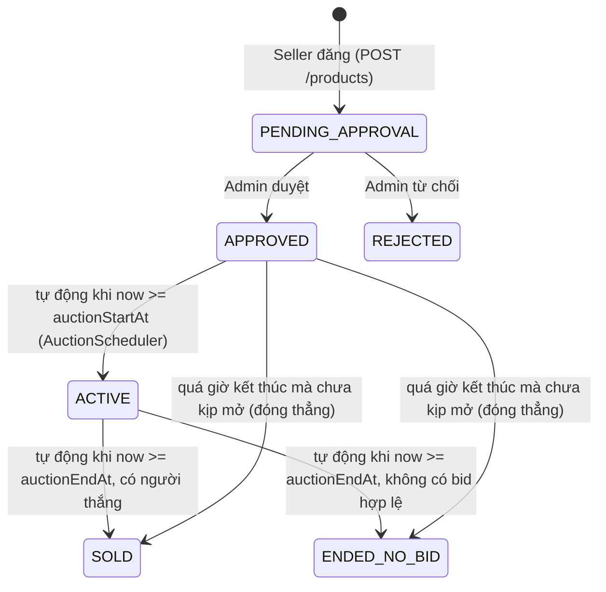
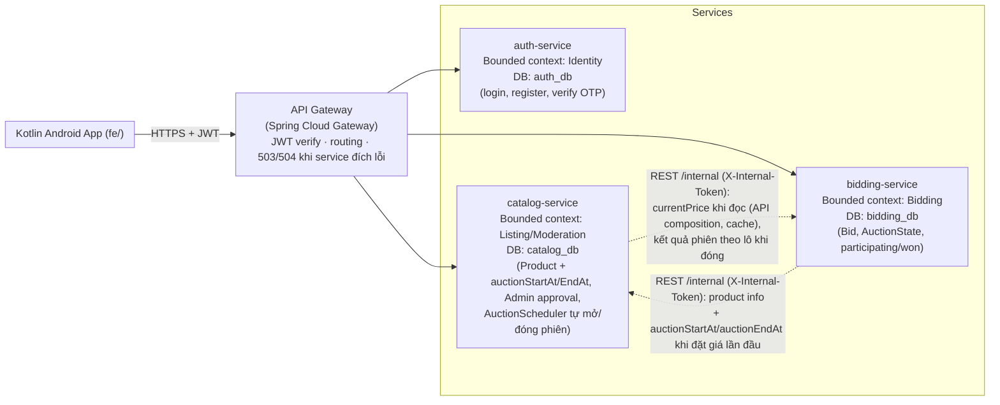

# Thiết kế kiến trúc hệ thống Đấu giá (Auction System) trên nền Kotlin Microservices

> Tài liệu phục vụ đề bài: *"Xây dựng ứng dụng bằng Kotlin theo kiến trúc microservice về hệ thống đấu giá"*, tập trung vào 3 yêu cầu chấm điểm: **tối ưu kiến trúc**, **technical challenges**, **performance evaluation**.
> Cơ sở: spec `HB4_1334_Auction System_User_Basic design_0.11 7.xlsx` (đầy đủ, ~30 màn hình kiểu sàn đấu giá ký gửi B2B) và 2 bài báo khảo sát thực tiễn ngành đã upload — dùng làm căn cứ học thuật cho phần tối ưu/challenges/evaluation.
> **Cập nhật 2026-09-21:** tài liệu đã được đối chiếu lại với mã nguồn hiện tại. Thay đổi lớn nhất là **bỏ khái niệm Event** — người bán đặt trực tiếp `auctionStartAt`/`auctionEndAt` trên sản phẩm, và `AuctionScheduler` tự mở/đóng phiên (mục 1.1, 3, 9.3, 9.4). Các cải tiến của đợt trước (API batch, cache, circuit breaker, token nội bộ, sửa lỗi tìm kiếm...) và cách đo được ghi ở `CHANGELOG_IMPROVEMENTS.md`, tài liệu này chỉ tham chiếu, không nhắc lại chi tiết.

---

## 1. Phạm vi triển khai (đã rút gọn so với spec gốc)

Spec gốc có ~30 màn hình với rất nhiều nghiệp vụ phức tạp (KYC, bulk auto-bidding, negotiation 8 bước cho hàng "held", box/lot, invoice, notification email...). Vì đây là đồ án học thuật giới hạn thời gian, chỉ triển khai tập con sau, mỗi dòng map trực tiếp tới Screen ID trong spec:

| Nhóm chức năng (spec) | Screen ID gốc | Quyết định | Lý do |
|---|---|---|---|
| Authentication: Login/Logout | USATS0020000, USATS0000000(F003) | Giữ nguyên | Bắt buộc để định danh user/seller/admin, là nền cho mọi quyền truy cập. |
| Authentication: Register + xác thực email (OTP) | (không có màn riêng trong phạm vi build; chức năng đăng ký nằm ngoài các màn USATS đã chọn) | **Đã triển khai** ở `auth-service`: `POST /api/auth/register`, `POST /api/auth/verify`, `POST /api/auth/resend-verification` (gửi mã OTP qua email) | Bản trước của tài liệu ghi "không làm Register, seed sẵn tài khoản demo"; hiện code đã có luồng đăng ký + xác thực OTP qua email. Vẫn **không** làm Forgot password vì không phải trọng tâm kiến trúc. |
| Auction: Auction detail | USEDS0010000 (Event Detail) | **Bỏ khỏi phạm vi** (giữ Screen ID chỉ để truy vết về spec). Khái niệm **Event** đã bị loại bỏ khỏi hệ thống; màn "Auction detail" đã bị xoá khỏi app | Trong spec, màn này là trang của một Event (phiên đấu giá chứa nhiều sản phẩm). Khi bỏ Event (mục 9.4) thì màn này không còn đối tượng để hiển thị; thời gian bắt đầu/kết thúc nay là thuộc tính của từng sản phẩm và hiển thị ở danh sách/chi tiết sản phẩm. Vẫn giữ giá trị composition catalog + bidding ở màn Product Detail. Box/lot và auto-bidding vẫn bị cắt như cũ. |
| Auction: Product search | USEDS001F003+F004 (Search & Filter Product trong Event Detail) | Gộp vào catalog-service, expose endpoint tìm kiếm toàn cục `GET /products?keyword=...` | Spec không có màn "product search" độc lập ở cấp cao nhất — chức năng tìm kiếm nằm trong Event Detail. Vì Event đã bỏ, tìm kiếm trở thành API độc lập (chỉ trả sản phẩm đang `ACTIVE`), tái dùng cho nhiều màn. |
| Auction: Product detail | USEDS0030000 (chỉ phần Basic Info + Bidding flow) | Giữ Basic Info + Manual Bidding, **bỏ toàn bộ Negotiation flow** (8 sub-flow held-product) và Auto Bidding | Negotiation flow là một state machine lớn (8 trạng thái, nhiều email trigger) — không phải trọng tâm minh chứng kiến trúc microservices, chỉ tốn effort code. Manual bidding mới là nơi có bài toán kiến trúc thật (race condition, consistency giữa services) đáng để đầu tư. |
| My page: Exhibition Management (quản lý sản phẩm đã đăng) | USMPS0080000..USMPS0130000 (gộp 6 màn con Listing All/Current/Held/Sold/Withdrawn + Sales Management) | Gộp thành **1 API** `GET /my/products` có filter theo status | Spec tách 6 màn chỉ khác nhau ở filter trạng thái — về kiến trúc chỉ là 1 query có điều kiện. Gộp lại để tiết kiệm effort mà không mất giá trị minh chứng. |
| My page: Exhibition product register (đăng sản phẩm) | USRPS0010000, USRPS0030000+0040000 (bỏ USRPS0020000 CSV import) | Giữ đăng đơn lẻ, bỏ import CSV hàng loạt. Người bán **nhập luôn giờ bắt đầu và giờ kết thúc đấu giá** khi đăng | CSV bulk import là tính năng vận hành, không phải bài toán kiến trúc. Đăng đơn lẻ đã đủ để minh chứng luồng PENDING_APPROVAL → Admin duyệt → tự động mở/đóng (yêu cầu bổ sung ở mục 1.1). |
| Product list: Participating | USMPS0020000 (Bidding List - All) | Giữ; chỉ trả sản phẩm mà phiên **chưa kết thúc** | Danh sách sản phẩm user đang tham gia đấu giá. |
| Product list: Won | USMPS0050000 (Won Item List - Win) | Giữ, bỏ Held/Withdrawn | "Held" và "Withdrawn" thuộc luồng negotiation đã cắt ở trên. |
| Product list: Memo list | USEDS003F004 "Add Memo for Product" | **Bỏ khỏi scope** | Xác nhận với user: đây không phải 1 màn hình riêng trong spec mà chỉ là 1 hành động phụ (thêm ghi chú cá nhân) gắn trên nhiều màn khác. Không có giá trị kiến trúc riêng, cắt để tập trung nguồn lực. |

### 1.1. Admin slice tối thiểu và vòng đời sản phẩm (yêu cầu bổ sung)

Mục tiêu: **chứng minh khái niệm "vai trò Admin tách biệt"**, không xây hệ quản trị đầy đủ.

- `User.isAdmin: Boolean` — không tạo bảng "role" riêng, đủ cho 1 vai trò nhị phân.
- Người bán khi đăng sản phẩm (`POST /api/products`) **bắt buộc** cung cấp `auctionStartAt` và `auctionEndAt` (ISO-8601 Instant). Backend trả `400` nếu thiếu, nếu `auctionEndAt` không sau `auctionStartAt` ("auctionEndAt must be after auctionStartAt"), hoặc nếu `auctionEndAt` đã ở quá khứ ("auctionEndAt must be in the future"). Hai mốc thời gian là cột `auction_start_at`/`auction_end_at` trên bảng `products` (migration `V4__remove_events_auction_time_on_product.sql`, có `CHECK (auction_end_at > auction_start_at)`).
- `Product.status` có state machine mới:



  Sản phẩm mới đăng luôn vào `PENDING_APPROVAL`, **không thể đấu giá được cho tới khi Admin duyệt và tới giờ bắt đầu**. Hai bước chuyển `APPROVED → ACTIVE` và `ACTIVE → SOLD/ENDED_NO_BID` do `AuctionScheduler` thực hiện tự động — xem mục 9.3. Nếu Admin duyệt một sản phẩm mà giờ kết thúc đã qua thì backend trả `409` ("The auction end time has already passed, cannot approve").
- Admin duyệt/từ chối: `POST /admin/products/{id}/approve`, `POST /admin/products/{id}/reject` (từ chối yêu cầu có lý do); xem danh sách chờ duyệt: `GET /admin/products/pending`.
- **Không còn Event**: các endpoint `POST /admin/events`, `GET /events`, `GET /events/{id}`, `PATCH /my/products/{id}/assign-event`, bảng `events`, trường `Product.eventId` và route Gateway `/api/events/**` đều đã bị xoá. Lý do và đánh đổi của quyết định này: mục 9.4.
- Điều thú vị: spec gốc **đã có sẵn tinh thần này** ở nhóm "Requested Products Management" (USRPS*) — seller gửi request, có "Send Message to Admin"/"View Communication", ngụ ý một luồng duyệt ở phía Admin dù spec không vẽ riêng màn Admin. Việc bổ sung Admin slice vì vậy không đi ngược thiết kế gốc mà hiện thực hoá phần đã ngầm định.

---

## 2. Tổng quan kiến trúc microservices

### 2.1. Nguyên tắc phân rã (decomposition)

Theo khảo sát thực tiễn ngành (*Waseem et al., "Design, Monitoring and Testing of Microservices Systems"*), chiến lược phân rã phổ biến nhất là **kết hợp Domain-Driven Design (DDD) + business capability** (42.3% người được khảo sát, Finding 4). Đồ án áp dụng đúng cách tiếp cận này: mỗi service ứng với một *bounded context* nghiệp vụ rõ ràng, không tách theo tầng kỹ thuật (không có kiểu "user-crud-service" chung chung).

3 service nghiệp vụ + 1 gateway:



Gateway **không có route nào cho `/internal/**`** (gọi vào sẽ ra 404); các endpoint nội bộ chỉ đi giữa service với service và còn yêu cầu header `X-Internal-Token`.

### 2.2. Bảng service — trách nhiệm & dữ liệu sở hữu

| Service | Bounded context | Sở hữu dữ liệu | API chính (qua Gateway) |
|---|---|---|---|
| **auth-service** | Identity & Access | `users` (id, email, passwordHash, fullName, isAdmin, trạng thái xác thực email/OTP) | `POST /api/auth/register`, `POST /api/auth/verify`, `POST /api/auth/resend-verification`, `POST /api/auth/login`, `POST /api/auth/logout`, `GET /api/users/me` |
| **catalog-service** | Listing & Moderation | `products` (status PENDING_APPROVAL..., `auction_start_at`, `auction_end_at`) | `GET /api/products`, `GET /api/products/{id}`, `POST /api/products` (kèm `auctionStartAt`, `auctionEndAt`), `POST/GET /api/products/{id}/image`, `GET /api/my/products`, `GET /api/admin/products/pending`, `POST /api/admin/products/{id}/approve\|reject` |
| **bidding-service** | Bidding & Settlement | `bids`, `auction_state` (read-model cục bộ) | `POST /api/products/{id}/bids`, `GET /api/products/{id}/bids`, `GET /api/my/bids/participating`, `GET /api/my/bids/won` |
| **api-gateway** | Edge / BFF | không (stateless) | Route (`/api/auth/**`, `/api/users/**`, `/api/products/**`, `/api/my/**`, `/api/admin/**`) + xác thực JWT, forward `X-User-Id`, `X-User-Admin`; trả `503` (không kết nối được) / `504` (quá thời gian) khi service đích lỗi thay vì `500` chung chung |

Pattern **Database-per-service** được áp dụng nghiêm ngặt (mỗi service 1 schema Postgres riêng, không service nào query trực tiếp DB của service khác) — đây cũng là pattern data-management được dùng thường xuyên nhất trong khảo sát thực tiễn (Finding 10, MSP9 "Database per service" ~49% often/very often).

**Access token pattern** (JWT, stateless) được chọn cho auth thay vì session — lý do trùng khớp với phát hiện MSP3 trong khảo sát: không cần lưu session ở service, token tự chứa thông tin, dễ scale ngang, service vẫn hoạt động độc lập nếu 1 node auth tạm downtime.

---

## 3. Luồng nghiệp vụ chính

### 3.1. Đăng sản phẩm (kèm giờ đấu giá) → Admin duyệt → Scheduler tự mở

```mermaid
sequenceDiagram
    participant Seller
    participant GW as API Gateway
    participant CAT as catalog-service
    participant Admin
    participant SCH as AuctionScheduler<br/>(catalog-service)

    Seller->>GW: POST /api/products {title, desc, startPrice, auctionStartAt, auctionEndAt,...}
    GW->>CAT: forward + X-User-Id
    CAT->>CAT: validate: end > start, end > now (nếu sai -> 400)
    CAT->>CAT: save Product(status=PENDING_APPROVAL, sellerId, auctionStartAt, auctionEndAt)
    CAT-->>Seller: 201 Created

    Note over CAT: Admin xem danh sách PENDING_APPROVAL

    Admin->>GW: POST /api/admin/products/{id}/approve
    GW->>CAT: forward + X-User-Admin=true
    CAT->>CAT: kiểm tra isAdmin; nếu auctionEndAt đã qua -> 409; ngược lại status=APPROVED
    CAT-->>Admin: 200 OK

    Note over SCH: Mỗi ~5s (auction-closing.interval-ms)
    SCH->>CAT: UPDATE Product SET status=ACTIVE<br/>WHERE status=APPROVED AND auctionStartAt <= now < auctionEndAt
    Note over CAT: Từ lúc này sản phẩm hiện ở Product Search và có thể được đặt giá
```

Không còn bước "tạo Event" và "gắn sản phẩm vào Event": thời gian đấu giá được người bán chốt ngay lúc đăng, và việc `APPROVED → ACTIVE` không cần thao tác thủ công nào.

### 3.2. Đặt giá (Manual Bidding) — nơi có bài toán kiến trúc thật

```mermaid
sequenceDiagram
    participant Bidder
    participant GW as API Gateway
    participant BID as bidding-service
    participant CAT as catalog-service

    Bidder->>GW: POST /api/products/{id}/bids {amount}
    GW->>BID: forward + X-User-Id

    alt Lần đặt giá đầu tiên cho product này (chưa có AuctionState)
        BID->>CAT: GET /internal/products/{id} (status, auctionStartAt, auctionEndAt, sellerId, startPrice)
        CAT-->>BID: product info (auctionStartAt/auctionEndAt lấy thẳng từ Product)
        alt status != ACTIVE
            BID-->>Bidder: 409 "The auction is not open for bidding"
        else now < auctionStartAt
            BID-->>Bidder: 409 "The auction has not started yet"
        else hợp lệ
            BID->>BID: tạo AuctionState(productId, sellerId, currentPrice=startPrice, auctionEndAt, version=0)
        end
    end

    BID->>BID: Transaction: đọc AuctionState hiện tại (optimistic lock)
    alt now < auctionEndAt AND bidderId != sellerId AND bidderId != currentBidderId AND amount > currentPrice
        BID->>BID: UPDATE AuctionState SET currentPrice=amount, currentBidderId, version=version+1<br/>WHERE version = old_version
        alt Update thất bại do version xung đột (2 bidder cùng lúc)
            BID->>BID: retry (backoff lũy thừa + jitter, tối đa 8 lần; hết lượt -> 503)
        end
        BID->>BID: INSERT Bid(productId, bidderId, amount, accepted=true)
        BID-->>Bidder: 200 OK, BidResponse(accepted=true)
    else Vi phạm 1 trong các điều kiện (đã hết giờ / là seller / đang dẫn giá / giá không đủ cao)
        BID->>BID: INSERT Bid(..., accepted=false) (bật/tắt bằng bidding.record-rejected-bids)
        BID-->>Bidder: 409 Conflict + message cụ thể
    end
```

Điểm mấu chốt: **`currentPrice` không được `catalog-service` sở hữu** dù về mặt hiển thị nó thuộc "thông tin sản phẩm". Nó thuộc bounded context Bidding vì nó chỉ thay đổi thông qua nghiệp vụ đặt giá và cần tính nhất quán tức thời khi có tranh chấp (race condition) — nếu để `catalog-service` giữ giá, 2 request đặt giá đồng thời sẽ phải cross-service lock, phức tạp và chậm hơn nhiều so với xử lý trong 1 transaction cục bộ của `bidding-service`.

`auctionEndAt` mà `bidding-service` dùng để chặn bid muộn nay đến **thẳng từ chính sản phẩm** (cột `products.auction_end_at`, qua `GET /internal/products/{id}` → `InternalProductInfo` mang cả `auctionStartAt` lẫn `auctionEndAt`), không còn phải suy ra từ Event. Hợp đồng mã phản hồi chi tiết của endpoint đặt giá (mọi vi phạm nghiệp vụ đều là `409`; `404` khi không có sản phẩm; `503` khi catalog lỗi hoặc hết lượt retry) nằm ở `CHANGELOG_IMPROVEMENTS.md` mục 1 và thay thế mô tả cũ trong `API_CONTRACT.md` mục 4.

Khi đọc **Product Detail** (`GET /api/products/{id}`), `catalog-service` gọi sang `bidding-service` để lấy `currentPrice` mới nhất rồi ghép vào response — đây chính là **API Composition pattern**, pattern data-management phổ biến thứ 2 theo khảo sát (Finding 10). Lời gọi này có cache ngắn hạn (`@Cacheable`, TTL `cache.current-price-ttl-seconds` = 3s) và circuit breaker + fallback (trả giá khởi điểm, đánh dấu "degraded" và không cache kết quả degraded) — xem `CHANGELOG_IMPROVEMENTS.md` mục 2, 6.

### 3.3. Tự động mở/đóng phiên đấu giá (AuctionScheduler)

```mermaid
sequenceDiagram
    participant Job as AuctionScheduler<br/>(catalog-service, @Scheduled)
    participant CAT as catalog-service DB
    participant BID as bidding-service

    loop Mỗi 5s (auction-closing.interval-ms)
        Note over Job,CAT: Bước 1 - MỞ
        Job->>CAT: openStarted(now): 1 câu UPDATE<br/>status=ACTIVE WHERE status=APPROVED AND start<=now AND end>now

        Note over Job,BID: Bước 2 - ĐÓNG (theo lô, tối đa 20 vòng/lượt)
        Job->>CAT: findExpired(now, batch=100)<br/>status IN (APPROVED, ACTIVE) AND auctionEndAt <= now
        Job->>BID: POST /internal/products/results {productIds: [...]} (1 lời gọi cho cả lô)
        BID-->>Job: [{productId, winnerId, finalPrice}] (sản phẩm không có trong kết quả = chưa có bid nào)
        loop Mỗi product trong lô
            alt có winnerId
                Job->>CAT: closeIfOpen(id, SOLD)
            else không có winnerId
                Job->>CAT: closeIfOpen(id, ENDED_NO_BID)
            end
            Note over CAT: closeIfOpen = UPDATE ... WHERE id=? AND status IN (APPROVED, ACTIVE); trả 0 nếu instance khác đã đóng trước
        end
        Note over Job: Nếu BID không phản hồi -> bỏ qua cả lượt đóng, giữ nguyên trạng thái, lượt sau thử lại (không đoán)
    end
```

Job chạy trong `catalog-service` (service sở hữu `Product.status`), không phải `bidding-service`. Mọi lần ghi là `UPDATE` có điều kiện theo trạng thái nên idempotent tự nhiên và an toàn kể cả khi chạy nhiều instance. Độ trễ mở/đóng tối đa bằng chu kỳ (mặc định 5 giây). Xem chi tiết implementation ở mục 9.3.

---

## 4. Tối ưu kiến trúc (Architecture Optimization)

| Vấn đề | Quyết định tối ưu | Căn cứ |
|---|---|---|
| Đặt giá đồng thời trên cùng sản phẩm (hot path, khả năng tranh chấp cao gần thời điểm đóng phiên) | **Optimistic locking** (`@Version`) trên `AuctionState` thay vì pessimistic lock (`SELECT ... FOR UPDATE`) | Optimistic lock không giữ khoá DB trong lúc xử lý business logic → throughput cao hơn khi tỉ lệ xung đột thấp/vừa (đa số sản phẩm không bị đặt giá dồn dập liên tục). Sẽ đo thực nghiệm ở mục 6 để xác nhận giả thuyết này thay vì chỉ suy diễn. |
| Đọc Product Detail phải tổng hợp dữ liệu từ 2 service (catalog + bidding) → tăng latency, và theo Villamizar et al. (trích trong `microservices.pdf`) *"response time increased when microservices architecture was utilized... because each request must go through the gateway to every microservice"* | Thêm **cache** (TTL ngắn, hiện cấu hình 3s qua `cache.current-price-ttl-seconds`) ở `catalog-service` cho `currentPrice` đọc từ `bidding-service` (`@Cacheable` trên `BiddingClient`, Redis là cache store); đọc cache trước, chỉ gọi cross-service khi cache miss | Giảm số lệnh gọi cross-service cho luồng đọc (đọc nhiều hơn ghi rất nhiều trong sàn đấu giá — hàng trăm view / 1 lần đặt giá), đánh đổi lấy độ trễ hiển thị giá tối đa vài giây, chấp nhận được vì giá thật vẫn được validate real-time tại thời điểm đặt giá ở `bidding-service`. Giá "degraded" (fallback) không được cache. |
| "Won list" (USMPS0050000) phải biết `auctionEndAt` (thuộc catalog) để xác định phiên đã kết thúc chưa, nếu gọi cross-service mỗi lần user mở màn "Won" sẽ rất chậm | `bidding-service` lưu **read-model cục bộ** `auction_state.auctionEndAt` (sao chép 1 lần khi tạo, không đồng bộ lại) thay vì gọi `catalog-service` mỗi lần | Đánh đổi kinh điển của MSA: chấp nhận duplicate 1 field tĩnh để đổi lấy service tự trị hoàn toàn cho read path — đúng tinh thần "share-as-little-as-possible" của MSA (đối lập SOA "share-as-much-as-possible", theo `desgin.pdf` mục 1). Field này thực sự tĩnh vì `auctionEndAt` do người bán chốt lúc đăng và không có API nào sửa sau đó. |
| Đóng phiên cho N sản phẩm hết giờ một lượt: gọi bidding-service N lần sẽ tốn N round-trip | `AuctionScheduler` hỏi kết quả **theo lô** qua `POST /internal/products/results` (≤ 500 id/lời gọi; scheduler dùng batch-size 100) thay vì `GET /internal/products/{id}/result` cho từng sản phẩm | Giảm số lời gọi cross-service từ N xuống ⌈N/100⌉ mỗi lượt; endpoint đơn lẻ vẫn còn nhưng scheduler không dùng. Kết quả đo ở `CHANGELOG_IMPROVEMENTS.md`. |
| Chọn pattern giao tiếp: đồng bộ (REST) hay bất đồng bộ (message broker/Kafka)? | Chọn **REST đồng bộ** cho toàn bộ, không dùng Kafka | Ở quy mô đồ án (3 service nghiệp vụ, không cần xử lý hàng loạt sự kiện, không cần fan-out tới nhiều consumer), REST đồng bộ đơn giản hơn, dễ debug, đủ đáp ứng yêu cầu độ trễ. Có đánh đổi: mất khả năng "resilience" khi 1 service down (điểm mạnh của async theo Newman, trích trong `microservices.pdf`) — được giảm nhẹ bằng timeout RestClient (connect 300ms, read 800ms) + circuit breaker Resilience4j + fallback ở đường đọc, và Gateway trả `503`/`504` rõ ràng; hướng đầy đủ (outbox pattern + Kafka) ghi nhận ở mục 7, không triển khai để giữ độ phức tạp vừa với effort. |
| Bảo mật giữa các service | **Access token (JWT) pattern** xác thực tại Gateway, mỗi service tự parse lại JWT (không tin tưởng mù quáng header forward từ Gateway); các endpoint `/internal/**` không có route ở Gateway và còn yêu cầu header `X-Internal-Token` | Đây là pattern bảo mật dùng nhiều nhất theo khảo sát (Finding 10). Việc mỗi service tự verify JWT (thay vì chỉ tin header) giảm rủi ro nếu có request nội bộ bị giả mạo, đổi lại code JWT-parsing bị lặp ở 3 service — chấp nhận trade-off để giữ service độc lập hoàn toàn (không dùng shared library dùng chung giữa services, tránh coupling lúc build/deploy). Token nội bộ là lớp phòng thủ thứ hai phòng khi cổng service bị mở ra ngoài nhầm. |
| Ranh giới bounded context Catalog vs Bidding có nên gộp làm 1 service cho đơn giản? | **Không gộp** — giữ tách biệt dù tăng 1 lần gọi cross-service khi đọc | Đây chính là DC1 "clearly defining the boundaries of microservices" — thách thức lớn nhất theo khảo sát (69.8%, xem mục 5). Nếu gộp, sẽ mất khả năng scale độc lập: bidding-service cần scale mạnh vào giờ cao điểm đóng phiên (write-heavy, latency-sensitive), trong khi catalog-service chủ yếu read-heavy, cần cache/CDN — 2 pattern scale khác nhau, gộp sẽ làm 1 bên kéo chậm bên kia. |
| Có cần thực thể "Event" (phiên đấu giá gom nhiều sản phẩm) không? | **Bỏ Event**, thời gian đấu giá là thuộc tính của từng sản phẩm | Giảm 1 bảng, 4 endpoint, 1 màn hình FE và 1 bước thủ công của Admin; xem mục 9.4 (lý do và đánh đổi). |

---

## 5. Technical Challenges

### 5.1. Thách thức chung của kiến trúc microservices (grounded theo khảo sát thực tiễn ngành, `desgin.pdf`)

Khảo sát 106 practitioner (Waseem et al.) cho thấy 3 thách thức thiết kế MSA hàng đầu — đối chiếu trực tiếp với đồ án:

1. **DC1 — Clearly defining the boundaries of microservices (69.8% người khảo sát gặp phải)**: Trong đồ án, ranh giới khó nhất là giữa `catalog-service` và `bidding-service` vì `currentPrice` "nhìn" giống thuộc tính sản phẩm nhưng thực chất là trạng thái đấu giá. Giải pháp áp dụng: xác định owner theo *ai là nguồn ghi (write authority)*, không theo *ai hiển thị dữ liệu đó* — `bidding-service` ghi, `catalog-service` chỉ đọc lại.
2. **DC2 — Addressing security concerns (46.2%)**: JWT bị forward qua Gateway → nếu 1 service nội bộ bị compromise, có thể giả mạo request tới service khác. Giải pháp: mỗi service tự verify chữ ký JWT (không tin header thuần), endpoint `/internal/**` yêu cầu `X-Internal-Token` và không có route ở Gateway, giới hạn network policy (docker-compose network riêng, `docker-compose.yml` chỉ publish cổng Gateway 8080; cổng 8081–8083 chỉ mở ở `docker-compose.dev.yml`).
3. **DC3 — Managing microservices complexity at design level (34.9%)**: 3 service nghiệp vụ + Gateway cho 1 đồ án nhỏ đã phát sinh: 3 loại DB riêng, JWT lặp code, cross-service call cần timeout/circuit breaker. Giải pháp giữ độ phức tạp trong tầm kiểm soát: **không** thêm service discovery (Eureka/Consul) hay message broker — dùng địa chỉ cố định qua Docker Compose network, đúng khuyến nghị "không thiết kế 1 service cho mọi feature" (Finding 12 khuyến nghị dùng DDD để tránh over-fragmentation). Việc bỏ Event (mục 9.4) cũng nằm trong cùng tinh thần: bớt một khái niệm và một bảng thay vì thêm.

### 5.2. Thách thức khi test & monitor (liên hệ RQ2/RQ3 trong khảo sát)

- **Testing challenge TC2 "Integration testing of microservices" (43.3%)**: đặt giá hợp lệ phụ thuộc trạng thái ở cả `catalog-service` (status, auctionStartAt/auctionEndAt) lẫn `bidding-service` (currentPrice) — 1 unit test không đủ, cần test tích hợp chạy cả 2 service (dùng Testcontainers cho Postgres + WireMock giả lập catalog-service khi test bidding-service). Hiện chưa dùng Testcontainers; đã có test đơn vị/tích hợp cục bộ và kịch bản end-to-end qua Gateway (xem `CHANGELOG_IMPROVEMENTS.md`, đầu mục "Trạng thái kiểm chứng" và mục 5 "Chưa làm").
- **Monitoring challenge MC1 "Collection of monitoring metrics data and logs from containers" (54.7%)**: mỗi service log riêng, khi 1 request đặt giá lỗi phải trace qua Gateway → bidding-service → catalog-service. Giải pháp tối thiểu: sinh/nhận `traceId` (header `X-Trace-Id`) trong filter của từng service, đưa vào MDC để log kèm traceId và chuyển tiếp trong các lời gọi RestClient nội bộ — chưa cần full distributed tracing (Zipkin/Jaeger) ở quy mô đồ án nhưng thiết kế sẵn điểm mở rộng.

### 5.3. Thách thức đặc thù bài toán đấu giá (không có trong khảo sát chung, tự phân tích)

- **Lost update khi 2 bidder đặt giá cùng lúc trên cùng sản phẩm**: giải quyết bằng optimistic locking (mục 4) — đây là nội dung sẽ đo bằng performance test (mục 6) để chứng minh giải pháp hoạt động đúng dưới tải đồng thời, không chỉ đúng về lý thuyết.
- **Tính nhất quán "gần đúng" (eventual) giữa 2 service khi hiển thị giá**: chấp nhận độ trễ cache vài giây ở read path, nhưng **không được chấp nhận** ở write path (đặt giá luôn phải đọc giá mới nhất trực tiếp từ `AuctionState` của `bidding-service`, không qua cache) — phải phân biệt rõ 2 luồng đọc/ghi có yêu cầu consistency khác nhau, tránh lỗi kinh điển "dùng cache cho cả đường ghi".
- **Mở/đóng phiên là quyết định "một lần" (one-shot) do thời gian, không thể suy ra động như "Won"**: khác với `currentBidderId`/`Won` (có thể tính lại bất cứ lúc nào từ dữ liệu bất biến), việc chuyển `Product.status` sang `ACTIVE` rồi `SOLD`/`ENDED_NO_BID` là side-effect ghi cần đúng thứ tự (không mở trước giờ bắt đầu, không đóng trước giờ kết thúc, không đóng sai nếu bidding-service tạm downtime) và an toàn khi nhiều instance chạy song song — đây là lý do `AuctionScheduler` (mục 9.3) dùng `UPDATE` có điều kiện theo trạng thái (`openStarted`, `closeIfOpen`) thay vì đọc-rồi-ghi, và bỏ qua cả lượt (không đoán) khi cross-service call thất bại.
- **Độ lệch giữa đồng hồ scheduler và đồng hồ bidding-service**: bid được chặn ở `bidding-service` theo `auctionEndAt` độc lập với `Product.status`, nên dù scheduler trễ vài giây mới đóng, bid muộn vẫn bị từ chối đúng; ngược lại `Product.status` (dùng cho hiển thị/tìm kiếm) có thể chậm tối đa một chu kỳ so với thực tế — chấp nhận và ghi rõ ở mục 9.4.

---

## 6. Performance Evaluation Plan

Áp dụng đúng phương pháp luận trong `microservices.pdf` (Al-Debagy & Martinek, dùng JMeter, đo **response time** và **throughput**, chạy nhiều kịch bản với số lượng thread/luồng tăng dần).

> Trạng thái hiện tại: kế hoạch JMeter chi tiết ở `JMETER_TEST_PLAN.md`; **JMeter chưa được chạy**. Số liệu thực đã có là bench tải trực tiếp trên bidding-service thật (PostgreSQL 16, N = 50–500 đúng 100%, 0 lỗi 5xx) và thử chịu lỗi (tắt bidding-service), xem `CHANGELOG_IMPROVEMENTS.md` mục 4. Các kịch bản dưới đây là kế hoạch đo đầy đủ.

### 6.1. Công cụ & môi trường

- **Apache JMeter** — công cụ chính, đúng công cụ dùng trong bài báo tham chiếu và cũng là tool testing phổ biến nhất theo khảo sát thực tiễn (Finding 17, JMeter 27.3%).
- **Spring Boot Actuator + Prometheus/Grafana** cho monitoring trong lúc test (resource usage, error rate) — 2 practice phổ biến nhất theo khảo sát (Finding 13/14: resource usage, log management). Code đã có Micrometer counter cho kết quả đặt giá (`bidding.bids`) và số lần xung đột version (`bidding.optimistic.conflicts`).
- Môi trường: docker-compose chạy trên 1 máy cố định, ghi rõ cấu hình (CPU/RAM) để kết quả tái lập được — tương tự cách bài báo mô tả server 16GB RAM.

### 6.2. Kịch bản test

| Kịch bản | Mục tiêu | Thiết kế (theo mẫu bài báo) |
|---|---|---|
| **Scenario 1 — Load test: đọc Product Detail** | Đo throughput/response time khi số user xem sản phẩm tăng dần | Bắt đầu 100 threads, ramp-up 2 phút, hold 2 phút, tăng dần tới 2000 threads (quy mô đồ án nhỏ hơn bài báo gốc 7000). So sánh **có cache** vs **không cache** cho `GET /products/{id}`. |
| **Scenario 2 — Concurrency test: đặt giá đồng thời trên 1 sản phẩm (hot path)** | Đo tỉ lệ xung đột (optimistic lock retry), throughput, và **đo tính đúng đắn**: tổng số bid thành công phải khớp — không được có "mất update" (2 bidder cùng thắng) | N threads (50 → 500) cùng gửi `POST /products/{id}/bids` cho **cùng 1 productId** trong cùng khoảng thời gian ngắn, không ramp-up (giống Scenario 2 trong bài báo — mô phỏng đúng lúc nhiều người tranh giá cuối phiên). Đo thêm: số lần retry trung bình mỗi request thành công. |
| **Scenario 3 — So sánh optimistic lock vs pessimistic lock** | Kiểm chứng giả thuyết tối ưu ở mục 4 bằng số liệu thực nghiệm, không chỉ lý thuyết | Chạy lại Scenario 2 với 2 bản build của `bidding-service`: 1 bản optimistic locking (mặc định), 1 bản đổi sang `SELECT ... FOR UPDATE`. So sánh throughput & p95 response time ở cùng mức tải. |
| **Scenario 4 — Test service discovery/gateway overhead** | Đo overhead của việc luôn phải qua Gateway (đúng phát hiện của Villamizar et al. trong `microservices.pdf`) | So sánh gọi trực tiếp `catalog-service:8082/products/{id}` vs gọi qua Gateway `gateway:8080/api/products/{id}`, đo chênh lệch response time trung bình. |

### 6.3. Metrics thu thập

- **Response time** (avg, p95, p99) — theo định nghĩa trong bài báo: *"the time elapsed between a request and reply"*.
- **Throughput** (requests/second thành công).
- **Error rate** (409 Conflict do hết hạn/giá không hợp lệ tách riêng khỏi lỗi hệ thống 5xx).
- **Correctness metric riêng cho Scenario 2**: `winning_bid_count == 1 per product` sau khi test kết thúc — kiểm tra bằng script đối chiếu DB `bidding_db`, không chỉ tin vào JMeter response code.

Kết quả dự kiến ghi vào báo cáo dưới dạng bảng + biểu đồ throughput/response-time theo số thread (giống Fig.2-8 trong `microservices.pdf`), kèm nhận xét đối chiếu có khớp xu hướng bài báo gốc hay không (bài báo: monolith nhanh hơn ở tải thấp, 2 kiến trúc hội tụ ở tải cao — đồ án chỉ có kiến trúc microservices nên sẽ so sánh nội bộ giữa các cấu hình tối ưu thay vì so với bản monolith).

---

## 7. Công nghệ & hướng mở rộng

**Stack**: Kotlin 1.9 + Spring Boot 3 (WebMVC, không dùng reactive để giữ đơn giản; riêng API Gateway dùng Spring Cloud Gateway nên chạy trên nền reactive) · Gradle Kotlin DSL multi-module · PostgreSQL (1 schema/service) · Flyway migration · Redis (cache) · Spring Cloud Gateway · JWT (jjwt) · Resilience4j (circuit breaker + fallback cho cross-service call) · Docker Compose.

**Không triển khai trong đồ án nhưng ghi nhận là hướng nâng cấp production** (đúng tinh thần "identify trade-off, không chỉ liệt kê pattern"):
- Service discovery (Eureka/Consul) — khảo sát cho thấy Consul cho throughput tốt hơn Eureka 3.8% (`microservices.pdf`, Scenario 3), đáng cân nhắc nếu số service tăng lên > 10.
- Kafka + Outbox pattern thay REST đồng bộ cho việc đồng bộ `currentPrice`/thông báo và cho việc đóng phiên (thay cho polling của `AuctionScheduler`) — tăng resilience khi 1 service downtime và triệt tiêu độ trễ tối đa một chu kỳ.
- Distributed tracing đầy đủ (Zipkin/Jaeger) thay vì chỉ traceId thủ công.
- Circuit breaker dashboard (Resilience4j + Grafana) khi số lượng cross-service call tăng.
- Khoá phân tán (ShedLock) cho `AuctionScheduler` khi chạy nhiều instance — hiện an toàn nhờ `UPDATE` có điều kiện nhưng các instance vẫn cùng quét và cùng gọi bidding-service (chưa làm, ghi ở `CHANGELOG_IMPROVEMENTS.md` mục 5).

---

## 8. Cấu trúc mã nguồn tương ứng

```
be/                         # Backend Kotlin microservices
  api-gateway/
  auth-service/
  catalog-service/
  bidding-service/
  docker-compose.yml        # chỉ publish Gateway 8080
  docker-compose.dev.yml    # publish thêm 8081-8083 để debug
fe/                          # Android app (Kotlin, Jetpack Compose) — khung tối thiểu
```

Xem chi tiết code trong `be/README.md` và `fe/README.md` tương ứng. Lưu ý: FE Android đã được sửa để bỏ Event (bỏ màn Auction Detail, hộp thoại Tạo Event của Admin, model/API Event; màn đăng sản phẩm bắt buộc nhập giờ) nhưng **chưa được biên dịch** do không có Android SDK (theo `CHANGELOG_IMPROVEMENTS.md` mục 7).

---

## 9. Đối chiếu Manual Bidding với spec gốc (sheet `USEDS0030000Product DetailBiddi`)

> Đọc trực tiếp lại sheet gốc trong `HB4_1334_Auction System_User_Basic design_0.11 7.xlsx`, **và đọc trực tiếp code thật của `bidding-service`/`catalog-service`** (không chỉ suy đoán từ tên file/tài liệu thiết kế) để đối chiếu từng rule. Đợt rà soát 2026-09-21 đã đối chiếu lại toàn bộ mục này với mã hiện tại.

### 9.1. Đã khớp — đã verify bằng code thật

- **Bidding Bar**: hiển thị Current Price, chip Step Value tính từ bảng mốc giá (mục I.5), nút "Đặt giá" disable khi user đang là người giữ giá cao nhất — khớp đúng component #3/#5/#6 trong spec.
- **Popup Bidding Confirmation**: tiêu đề xác nhận + hiển thị giá hiện tại/giá đặt thầu + 2 nút Hủy/Xác nhận — khớp cấu trúc component "2. Popup: Bidding Confirmation".
- **Rule 1.0 (mục 3.3)** "Buyer không được bid 2 lần liên tiếp, phải có người khác bid cao hơn mới được bid tiếp" — **đã được cài đặt ở backend**, verify bằng code thật `bidding-service/service/BidTransactionExecutor.kt`: hàm `rejectionOf` có nhánh `bidderId == state.currentBidderId` → `RejectReason.ALREADY_HIGHEST_BIDDER` với thông điệp "You are already the highest bidder; wait for another bid before bidding again", trả `409` (bid bị ghi lại với `accepted=false` nếu `bidding.record-rejected-bids` bật). Thứ tự kiểm tra trong code: hết giờ → là seller → đang dẫn giá → giá không cao hơn `currentPrice`; khi vi phạm nhiều điều kiện cùng lúc thì thông điệp của điều kiện đứng trước được trả về.
- **Rule 3.0 (mục 3.3)** công thức số tiền bid = Current Price + Step Value cho cả lần đầu (Current Price = Start Price khi chưa ai bid) lẫn các lần sau — phía backend chỉ ràng buộc `amount > currentPrice`; việc tính đúng bước giá (Step Value) là trách nhiệm của FE. Không có kiểm tra "đúng bội số bước giá" ở backend.
- **Rule 4.0 (mục 3.3)** tinh thần "bid sớm nhất thắng khi tranh chấp" — khớp về mặt kết quả nhờ optimistic locking (ai commit trước thắng).
- **Seller không được tự bid sản phẩm của mình (spec mục I.2)** — **đã verify bằng code thật `bidding-service/service/BidTransactionExecutor.kt`**: nhánh `bidderId == state.sellerId` → `RejectReason.SELLER_CANNOT_BID` với thông điệp "Sellers cannot bid on their own product" (`409`). Đúng nghiệp vụ đấu giá: **user khác được đấu giá sản phẩm 1, còn chính seller đã tạo sản phẩm 1 thì không được** — quyết định lưu `sellerId` ngay trên `AuctionState` (không tin lại `X-User-Id` header) cũng đúng tinh thần "mỗi service tự validate, không tin dữ liệu forward" đã nêu ở mục 5.1 DC2.
  - Gap còn lại: chỉ có backend chặn, **FE chưa chủ động ẩn nút** khi người xem chính là seller — trải nghiệm là seller vẫn thấy nút "Đặt giá", bấm mới nhận lỗi. Không sai nghiệp vụ, chỉ là chưa tối ưu UX (có thể bổ sung sau nếu muốn).
- **Chặn bid ngoài thời gian đấu giá — đã verify bằng code**: `auctionStartAt`/`auctionEndAt` nay là cột thật trên `Product` (do người bán nhập khi đăng, mục 1.1). `catalog-service` trả cả hai qua `GET /internal/products/{id}` (`InternalProductInfo`). Ở lần bid đầu tiên (khởi tạo `AuctionState`), `BiddingService.initializeAuctionState` từ chối `409` "The auction is not open for bidding" nếu `status != ACTIVE` (hoặc không có `auctionEndAt`) và `409` "The auction has not started yet" nếu `now < auctionStartAt`. Từ đó về sau, mỗi bid được chặn theo `now.isBefore(state.auctionEndAt)` (`409` "The auction has ended"). Lưu ý trung thực: điều kiện `status == ACTIVE` và `auctionStartAt` **chỉ được kiểm tra một lần lúc khởi tạo `AuctionState`**; sau khi state đã tồn tại, cổng chặn duy nhất mỗi bid là `auctionEndAt` (đủ đúng vì `auctionEndAt` không đổi sau khi đăng và `auctionStartAt` khi đó đã qua). Response công khai cho client (`ProductResponse`/`ProductSummaryResponse`) nay trả `auctionStartAt` và `auctionEndAt` (thay cho `eventId` cũ), nên màn Product Detail có thể hiển thị/ẩn Bidding Bar theo thời gian.

### 9.2. Đã cắt khỏi phạm vi đồ án — có chủ đích (bổ sung so với bảng ở mục 1)

- Toàn bộ **Auto Bidding** (mục 3.2, 5, 6 của sheet) — đã ghi ở mục 1.
- **Diamond event type** (đơn vị `@`/carat riêng cho kim cương, mục 3.3 rule 2.0) — không mô hình hoá, chỉ dùng 1 loại tiền tệ.
- **Negotiation flow / trạng thái Held** khi hết giờ không đạt giá mong muốn (mục 3.3 rule 11.0, mục 7) — đã ghi ở mục 1. Trường hợp "No Win" (hết giờ không có bid nào) được xử lý tối giản bằng `ProductStatus.ENDED_NO_BID` (mục 9.3) thay vì luồng negotiation đầy đủ của spec gốc.
- **Notification & Email** (toàn bộ mục 8 của sheet + màn `USNOS0010000 Bidding Notification`) — chưa từng liệt kê tường minh trong bảng phạm vi ở mục 1, bổ sung ghi nhận tại đây: không gửi mail/notification khi mất vị trí cao nhất, khi bị outbid, khi thắng, **kể cả khi `AuctionScheduler` đóng phiên** — chấp nhận được cho đồ án học thuật nhưng cần nêu rõ khi bảo vệ đồ án nếu được hỏi. (Ngoại lệ duy nhất: email chứa mã OTP khi đăng ký/gửi lại xác thực ở auth-service, mục 1.)
- **Điều kiện buyer hợp lệ (mục I.2)**: "được duyệt", "nằm trong danh sách mời của Event", "không bị seller block" — hệ thống hiện tại không có khái niệm buyer-approval, block-list hay danh sách mời (không còn Event nào để mời; đã đơn giản hoá `User.isAdmin` nhị phân theo mục 1.1), nên toàn bộ nhóm điều kiện này không áp dụng được — chấp nhận là giản lược phạm vi đồ án.
- **Toggle cá nhân `入札モーダル`** (My Page Settings — bật/tắt popup xác nhận trước khi bid): FE hiện luôn hiện popup, không có màn setting tương ứng (`USPFS0030000` không nằm trong phạm vi build) — giản lược hợp lý.

### 9.3. Tự động mở/đóng phiên: AuctionScheduler

**Vấn đề gốc** (mục 7 của sheet: chuyển trạng thái sản phẩm theo thời gian): ở phiên bản đầu, `Product.status` không bao giờ tự chuyển sang `SOLD` khi hết giờ — enum có định nghĩa `SOLD` nhưng không có chỗ nào set giá trị này, khiến sản phẩm đã hết giờ vẫn hiển thị `ACTIVE` ở Product Search và vẫn hiện Bidding Bar ở Product Detail. Bản kế tiếp thêm `AuctionClosingJob` (chạy 60s, quét sản phẩm `ACTIVE` bằng cách JOIN với bảng `Event`, hỏi bidding-service từng sản phẩm một). Sau khi bỏ Event (mục 9.4), thời gian nằm ngay trên `Product` nên job được viết lại thành `AuctionScheduler`, đồng thời làm luôn việc **mở** phiên (`APPROVED → ACTIVE`) mà trước đây là thao tác thủ công "gắn sản phẩm vào Event".

**Đã chọn hướng đầy đủ** (không phải hướng FE-only tối thiểu): `AuctionScheduler` — `@Scheduled` component trong `catalog-service`, chu kỳ cấu hình qua `auction-closing.interval-ms` (mặc định **5000ms**, `application.yml`), kích thước lô `auction-closing.batch-size` (mặc định **100**). Bật bằng `@EnableScheduling` trên `CatalogServiceApplication`.

Thiết kế implementation (file `catalog-service/.../job/AuctionScheduler.kt`, `@Scheduled(fixedDelayString = "${auction-closing.interval-ms:5000}") fun tick()`), mỗi lượt gồm 2 bước:

1. **Bước 1 — MỞ (`openStartedAuctions`)**: gọi `ProductRepository.openStarted(now)`, một câu `UPDATE` JPQL đổi `status = 'ACTIVE'` cho mọi sản phẩm `status = 'APPROVED' AND auctionStartAt <= now AND auctionEndAt > now`, trả về số dòng đã mở. Là một câu lệnh cho cả lô, idempotent, an toàn khi chạy nhiều instance. Điều kiện `auctionEndAt > now` bảo đảm không mở sản phẩm đã quá hạn.
2. **Bước 2 — ĐÓNG (`closeEndedAuctions`)**:
   - Tìm sản phẩm cần đóng: `ProductRepository.findExpired(now, PageRequest(0, batchSize))` — lọc `status IN ('APPROVED','ACTIVE') AND auctionEndAt <= now`, sắp `auctionEndAt ASC` (hết hạn sớm nhất trước). Lấy cả `APPROVED` để không sót sản phẩm chưa kịp mở (ví dụ hệ thống tạm dừng qua giờ kết thúc). Không còn JOIN với Event vì thời gian nằm sẵn trên `Product`; migration `V4` thêm index `(status, auction_start_at)` và `(status, auction_end_at)` để phục vụ đúng các truy vấn quét này.
   - Xác định người thắng **theo lô**: `BiddingClient.getAuctionResults(ids)` gọi `POST /internal/products/results` với `{productIds: [...]}` của `bidding-service` (`InternalController.kt`, tối đa 500 id/lời gọi), trả `[{productId, winnerId, finalPrice}]` đọc từ `AuctionState`. Sản phẩm không xuất hiện trong kết quả nghĩa là chưa từng có `AuctionState` (chưa ai bid) → không có người thắng. `BiddingClient` có `@CircuitBreaker` (name "bidding") và **không** `@Cacheable` cho lời gọi này (đây là quyết định ghi một lần, phải dùng dữ liệu mới nhất); nếu bidding-service không phản hồi, fallback trả `null` để scheduler bỏ qua cả lượt đóng, giữ nguyên trạng thái, lượt sau thử lại thay vì lỡ tay đóng sai. Endpoint đơn lẻ `GET /internal/products/{id}/result` vẫn còn trong bidding-service nhưng scheduler không dùng.
   - Cập nhật trạng thái: có `winnerId` → `SOLD`; không có → `ENDED_NO_BID` (cách xử lý tối giản cho case "No Win" thay cho luồng Held/Negotiation của spec gốc, xem mục 9.2). Việc ghi dùng `ProductRepository.closeIfOpen(id, target, now)`: `UPDATE ... WHERE id = :id AND status IN ('APPROVED','ACTIVE')`, trả `0` nếu instance khác đã đóng trước.
   - Lặp theo lô: tối đa 20 vòng mỗi lượt (`MAX_ROUNDS_PER_RUN`); dừng khi lô cuối nhỏ hơn `batchSize` hoặc không đóng thêm được gì (tránh lặp vô hạn trên cùng một lô).
3. **Idempotency / đa instance**: mọi lần ghi là `UPDATE` có điều kiện theo trạng thái nên sản phẩm đã đóng ở lượt trước sẽ không còn được `findExpired` "thấy" và bên đến sau không ghi đè bên đến trước — an toàn khi job chạy chồng lấn, chạy trễ hoặc chạy nhiều instance (chưa có ShedLock nên các instance vẫn cùng quét, nhưng không sai dữ liệu).
4. **Không ảnh hưởng tính đúng đắn của bid**: `bidding-service` tự chặn bid theo `auctionEndAt` (mục 9.1) độc lập với `Product.status`, nên dù scheduler trễ vài giây mới đóng, các bid đến sau giờ kết thúc vẫn bị từ chối đúng; scheduler chỉ đồng bộ lại `Product.status` cho đúng nghiệp vụ hiển thị/tra cứu (Product Search, Exhibition Management), không phải cơ chế chặn bid muộn. Ngược lại, sản phẩm chưa `ACTIVE` không có `AuctionState` hợp lệ nên `bidding-service` từ chối `409` ở lần bid đầu (mục 9.1).

**Đã triển khai** (trong `be/`):
- `catalog-service/.../job/AuctionScheduler.kt`: thay `AuctionClosingJob.kt`, chứa toàn bộ logic mở/đóng.
- `catalog-service/.../repository/ProductRepository.kt`: `findExpired`, `openStarted`, `closeIfOpen`.
- `catalog-service/.../client/BiddingClient.kt`: `getAuctionResults(ids)` (batch) + fallback.
- `bidding-service/.../controller/InternalController.kt`: `POST /internal/products/results` (batch), giữ `GET /internal/products/{id}/result` và `GET /internal/products/{id}/current-price`.
- `catalog-service/.../domain/ProductStatus.kt`: có `APPROVED`, `ACTIVE`, `SOLD`, `ENDED_NO_BID`, `REJECTED`, `PENDING_APPROVAL`.
- `catalog-service/src/main/resources/db/migration/V4__remove_events_auction_time_on_product.sql`: thêm cột thời gian, chuyển dữ liệu cũ, xoá `event_id`/bảng `events`, thêm index.
- `application.yml`: `auction-closing.interval-ms: 5000`, `auction-closing.batch-size: 100`.

**Kết quả kiểm chứng**: theo `CHANGELOG_IMPROVEMENTS.md` mục 4, chạy end-to-end qua Gateway trên mã đã bỏ Event thì phiên tự mở lúc 14:45:41 cho giờ bắt đầu 14:45:39 và tự đóng lúc 14:45:56 cho giờ kết thúc 14:45:54; người thắng thấy ở `/my/bids/won`.

**Còn thiếu / có thể bổ sung sau nếu cần** (không chặn tiến độ đồ án, ghi nhận để nêu khi bảo vệ):
- FE Android đã bỏ Event nhưng **chưa được biên dịch/chạy thử**, và FE chưa hiển thị trạng thái `ENDED_NO_BID` riêng biệt (cần thêm case UI tương ứng); FE cũng chưa gửi `reason` khi Admin từ chối sản phẩm (backend bắt buộc → có thể `400`).
- Chưa có test tích hợp riêng cho `AuctionScheduler` bằng Testcontainers + WireMock giả lập bidding-service (mục 5.2); việc kiểm chứng hiện dựa trên kịch bản end-to-end thủ công/`e2e.py`.
- Chưa có khoá phân tán (ShedLock) để chỉ một instance chạy scheduler; chưa có metric đếm lần fallback.
- Chưa lưu `finalPrice`/`winnerId` xuống `Product` — muốn hiển thị "giá bán cuối" ở Exhibition Management thì `ProductResponse` vẫn phải composition sang bidding-service như hiện tại (không đổi kiến trúc, chỉ là chưa cache lại).
- Gateway đã trả `503`/`504` khi service đích lỗi; các lỗi 400/404 do framework ở `GlobalExceptionHandler` của auth-service vẫn cần rà lại (theo `CHANGELOG_IMPROVEMENTS.md` mục 5).

### 9.4. Quyết định thiết kế: bỏ Event

**Bối cảnh.** Spec gốc xoay quanh "Event" (phiên đấu giá chứa nhiều sản phẩm, có trang Event Detail USEDS0010000). Phiên bản đầu của hệ thống mô phỏng lại khái niệm này: Admin tạo Event (`POST /admin/events`) với `startTime/endTime`, seller gắn sản phẩm đã duyệt vào Event (`PATCH /my/products/{id}/assign-event`), sản phẩm mới thành `ACTIVE`; giờ kết thúc phải suy ra từ Event qua `eventId`.

**Quyết định.** Bỏ hoàn toàn Event. Người bán đặt `auctionStartAt`/`auctionEndAt` ngay khi đăng sản phẩm (cả hai bắt buộc); hệ thống tự mở/đóng theo thời gian (mục 9.3).

**Lý do.**
- **Đơn giản hoá**: bớt 1 bảng (`events`), 4 endpoint (`POST /admin/events`, `GET /events`, `GET /events/{id}`, `PATCH /my/products/{id}/assign-event`), 1 route Gateway, 1 trường (`Product.eventId`) và ở FE là màn Auction Detail cùng hộp thoại Tạo Event.
- **Không còn nút thắt ở Admin**: trước đây sản phẩm không thể vào đấu giá nếu Admin chưa tạo Event và seller chưa gắn vào; nay Admin chỉ còn một việc là duyệt/từ chối.
- **Lịch theo từng sản phẩm**: mỗi sản phẩm có cửa sổ đấu giá riêng, phù hợp với mô hình seller tự đăng và phần lõi cần minh chứng (bidding đồng thời, tính nhất quán giữa service) không phụ thuộc vào việc gom nhóm.
- **Bớt phụ thuộc ngầm**: `auctionEndAt` dùng để chặn bid nằm ngay trong dữ liệu sở hữu bởi `catalog-service`, hết cảnh phải join/suy ra từ một thực thể khác (nguồn gốc của nghi ngờ "field chết" ở các bản trước).

**Đánh đổi (trade-off) chấp nhận.**
- **Không còn phiên đấu giá gom nhiều sản phẩm** (không có trang "sự kiện" gồm một danh sách lot cùng bắt đầu/kết thúc), tức mất một phần tinh thần của spec gốc kiểu sàn ký gửi B2B.
- **Thời gian cố định từ lúc đăng**: không có API sửa `auctionStartAt/auctionEndAt` sau khi đăng; muốn đổi lịch phải đăng lại. Đồng thời, nếu Admin duyệt quá muộn khiến giờ kết thúc đã qua thì bị từ chối `409` và seller phải đăng lại; sản phẩm APPROVED nhưng đã quá hạn sẽ được scheduler đóng thẳng thành `ENDED_NO_BID`/`SOLD`.
- **Độ trễ do polling**: `Product.status` có thể chậm hơn thực tế tối đa một chu kỳ scheduler (mặc định 5 giây) khi mở/đóng; đây chỉ ảnh hưởng hiển thị/tìm kiếm vì bid muộn vẫn bị `bidding-service` chặn theo `auctionEndAt`. Giảm độ trễ có thể chỉnh `auction-closing.interval-ms`, hoặc về lâu dài dùng cơ chế sự kiện (mục 7).
- **Dữ liệu cũ phải di trú**: migration `V4` chuyển thời gian từ event của sản phẩm đã gắn; sản phẩm chưa gắn event nhận cửa sổ mặc định 7 ngày từ lúc tạo; trạng thái `ACTIVE` cũ được giữ nguyên và scheduler đóng những sản phẩm đã quá hạn.
