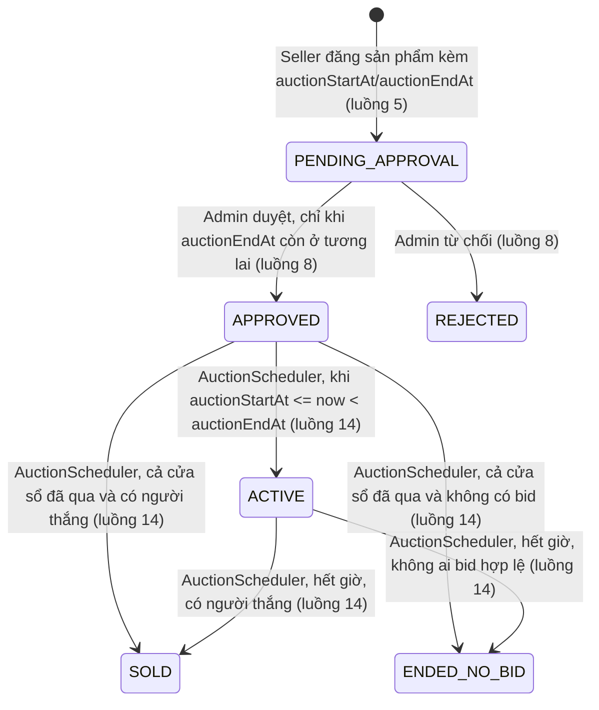
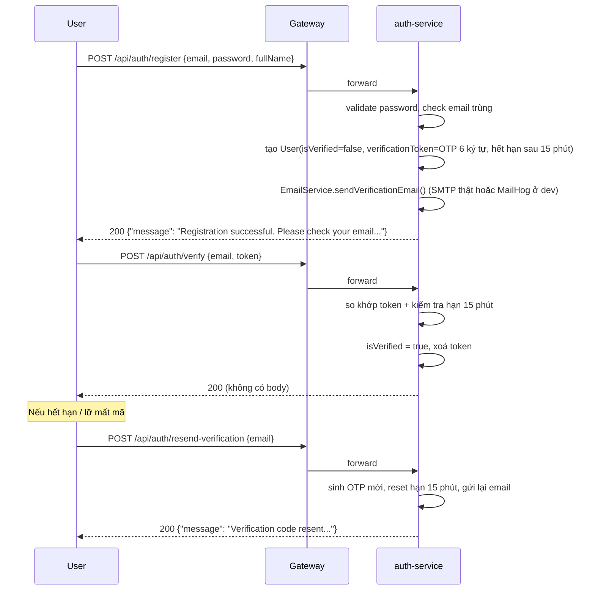
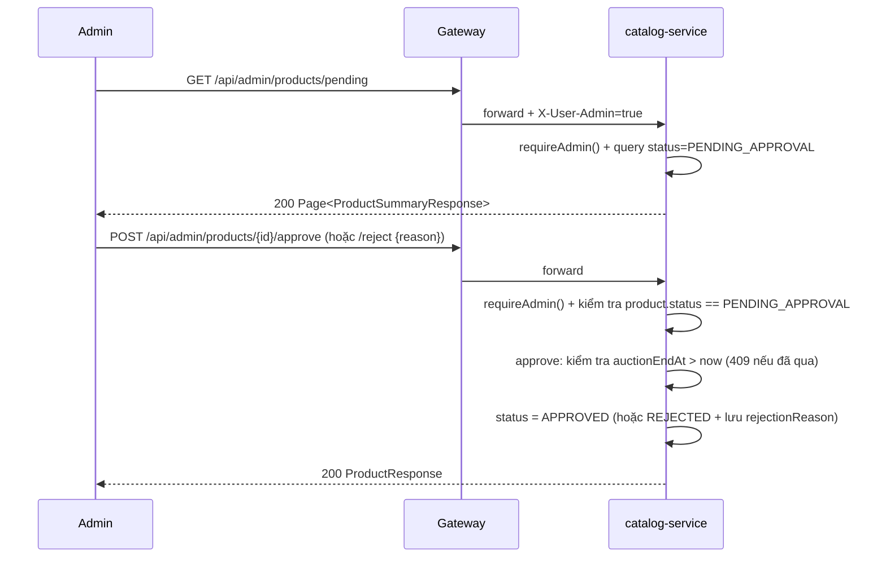
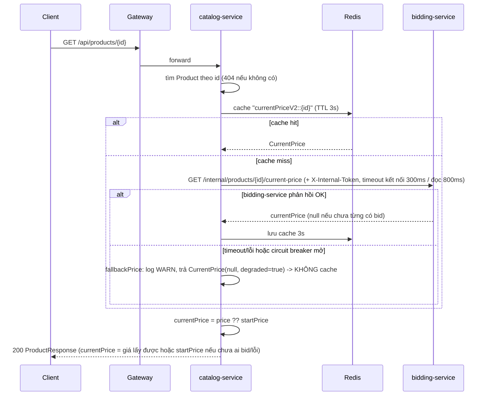
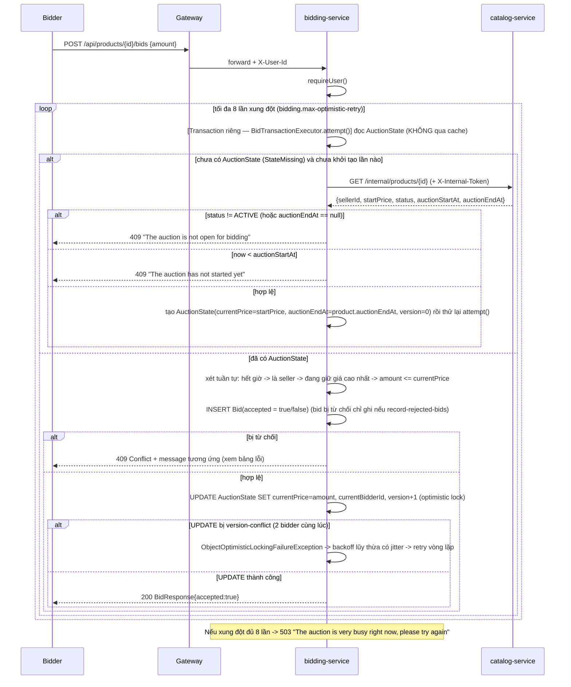
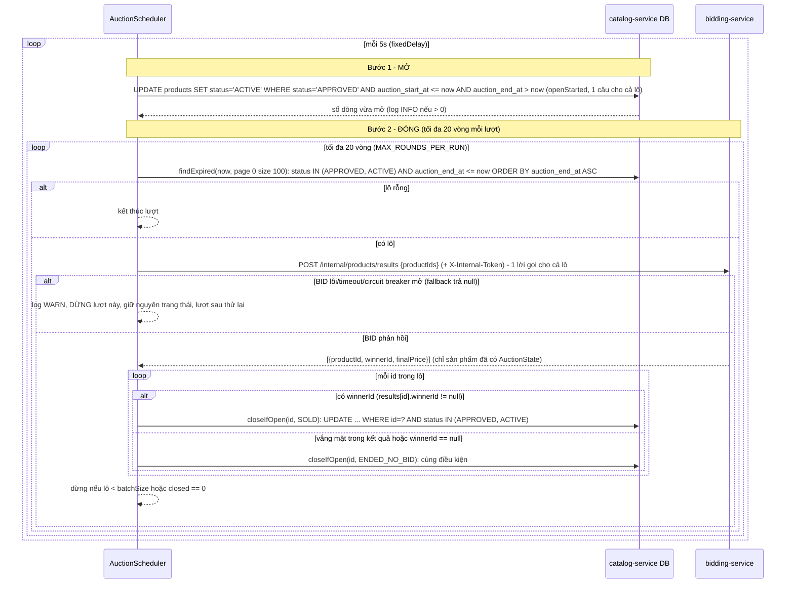

# Đặc tả nghiệp vụ theo luồng (Flow Spec) — dựng lại từ code thật `be/`

> Tài liệu này **không suy đoán** — mọi quy tắc, mã lỗi, field đều đọc trực tiếp từ source code Kotlin trong `be/{auth,catalog,bidding}-service` + `api-gateway` (đường dẫn cụ thể ghi ở cuối mỗi mục). Mục tiêu: tài liệu hoá **hành vi thật của hệ thống hiện tại**, kể cả những chỗ đã lệch so với `ARCHITECTURE_DESIGN.md`/`API_CONTRACT.md` — các chỗ lệch được đánh dấu ⚠️ và giải thích, không tự ý "sửa cho khớp".
>
> Đối tượng dùng tài liệu: viết báo cáo đồ án (mô tả luồng nghiệp vụ), hoặc làm test case (JMeter/Postman) theo đúng hành vi thật thay vì hành vi dự định ban đầu.
>
> **Đã bỏ khái niệm Event.** Phiên bản code hiện tại không còn entity/bảng/service/controller `Event`, không còn `POST /admin/events`, `GET /events`, `GET /events/{id}`, `PATCH /my/products/{id}/assign-event`, route Gateway `/api/events/**` và `Product.eventId`. Thời gian đấu giá (`auctionStartAt`, `auctionEndAt`) do **seller nhập trực tiếp khi đăng sản phẩm** và nằm trên chính `Product`; việc mở/đóng phiên do `AuctionScheduler` tự chạy. Vì vậy số thứ tự luồng đã được đánh lại (đối chiếu với bản cũ: luồng 9/10/12 cũ — tạo Event, gắn Event, xem chi tiết Event — đã bị xoá; luồng 11 cũ thành 9; 13 cũ thành 10; 14 cũ thành 11; 15 cũ thành 12; 16 cũ thành 13; 17 cũ thành 14).

## Mục lục luồng

1. Đăng ký tài khoản + xác thực email (OTP)
2. Đăng nhập
3. Xem thông tin cá nhân
4. Đăng xuất
5. Đăng sản phẩm (Seller) — kèm thời gian đấu giá
6. Upload / xem ảnh sản phẩm
7. Quản lý sản phẩm của tôi (Exhibition Management)
8. Admin duyệt / từ chối sản phẩm
9. Tìm kiếm / xem danh sách sản phẩm (public)
10. Xem chi tiết sản phẩm (ghép giá real-time)
11. **Đặt giá thủ công (Manual Bidding)** — luồng lõi
12. Xem lịch sử đặt giá
13. Sản phẩm đang tham gia (Participating) / đã thắng (Won)
14. Tự động mở / đóng phiên đấu giá theo giờ (background job `AuctionScheduler`)

State machine tổng quát của `Product.status` (mọi luồng bên dưới đều xoay quanh state này):

Không còn thao tác thủ công nào chuyển `APPROVED -> ACTIVE` (trước đây là seller gắn sản phẩm vào Event) — toàn bộ chuyển trạng thái sau khi duyệt do đồng hồ + `AuctionScheduler` quyết định. Cạnh `APPROVED -> SOLD/ENDED_NO_BID` chỉ xảy ra khi sản phẩm được duyệt nhưng scheduler chưa kịp mở mà cả cửa sổ đã trôi qua (xem luồng 14).

---

## 1. Đăng ký tài khoản + xác thực email (OTP)

⚠️ **Phát hiện quan trọng**: `ARCHITECTURE_DESIGN.md` (mục 1, mục 9.2) khẳng định "**không làm Register**, seed sẵn tài khoản demo bằng Flyway". Điều này **không còn đúng với code hiện tại** — `auth-service` đã có đầy đủ 3 endpoint `register` / `verify` / `resend-verification`, hoạt động thật (không phải mock). Tài liệu kiến trúc cần được cập nhật lại phần này. (Comment đầu file `V2__seed.sql` cũng còn ghi "không có màn Register trong scope" — đã lỗi thời.)

- **Vai trò**: Người dùng chưa có tài khoản (Seller/Bidder — không tự đăng ký được tài khoản Admin).
- **Endpoint**: `POST /api/auth/register`, `POST /api/auth/verify`, `POST /api/auth/resend-verification` — route qua Gateway tới `auth-service` (không cần JWT).

### Luồng chính

### Quy tắc nghiệp vụ / validate

| Trường | Ràng buộc |
|---|---|
| `email` | Định dạng email hợp lệ (`@Email`, `@NotBlank`), không trùng user đã tồn tại |
| `password` | Tối thiểu 8 ký tự **và** phải có cả chữ lẫn số (regex `^(?=.*[A-Za-z])(?=.*\d).+$`) — validate ở cả tầng DTO (`@Size(min=8)` + `@Pattern`, 2 message riêng) lẫn lại 1 lần trong `AuthService.register()` (1 message gộp) |
| `fullName` | Bắt buộc, không rỗng |
| OTP (`verificationToken`) | 6 ký tự, lấy từ `UUID.randomUUID().toString().substring(0,6).uppercase()` (không phải số ngẫu nhiên đơn thuần — có thể chứa cả chữ) |
| Hạn OTP | 15 phút kể từ lúc sinh (`VERIFICATION_TOKEN_TTL_MINUTES = 15`), cả lần đăng ký đầu lẫn lần resend |
| Đăng nhập khi `isVerified = false` | Bị chặn ở luồng 2 (login trả `403`) |

### Luồng lỗi

| Tình huống | HTTP | Message |
|---|---|---|
| Email đã tồn tại | 409 | `Email is already in use` |
| Password < 8 ký tự (chặn ở DTO) | 400 | `password: Password must be at least 8 characters` |
| Password thiếu chữ hoặc thiếu số (chặn ở DTO) | 400 | `password: Password must contain both letters and digits` |
| Password không đạt nhưng lọt qua DTO (re-check trong service) | 400 | `Password must be at least 8 characters and contain both letters and digits` |
| `verify`: email không tồn tại | 404 | `No user found with this email` |
| `verify`: tài khoản đã verify rồi | 400 | `Account has already been verified` |
| `verify`: token sai | 400 | `Invalid verification code` |
| `verify`: token hết hạn | 400 | `Verification code has expired, please request a new one` |
| `resend-verification`: email không tồn tại | 404 | `No user found with this email` |
| `resend-verification`: đã verify rồi | 400 | `Account has already been verified` |

(Khi lỗi Bean Validation, message có dạng `"<field>: <message>"`, nhiều lỗi nối bằng `; ` — theo `GlobalExceptionHandler` của từng service. Riêng `verify`: kiểm tra thứ tự là tồn tại -> đã verify -> token sai -> hết hạn.)

### Dữ liệu

Bảng `users` (`auth_db`, service **duy nhất sở hữu**): `id, email (unique), password_hash (BCrypt), full_name, is_admin, is_verified, verification_token, verification_token_expires_at, created_at`. Không có bảng "role" riêng — `is_admin` là boolean nhị phân.

**Ghi chú vận hành**: `EmailService` luôn log OTP ra console (kể cả khi gửi SMTP thất bại — lỗi gửi chỉ được log, request `register`/`resend` vẫn trả 200) — hữu ích khi test không có mailbox thật. Docker compose mặc định trỏ SMTP tới `mailhog` (xem UI tại `http://localhost:8025`), đổi sang SMTP thật (Gmail App Password...) qua file `.env`.

**Nguồn**: `auth-service/.../controller/AuthController.kt`, `service/AuthService.kt`, `service/EmailService.kt`, `domain/User.kt`, `dto/AuthDtos.kt`, migration `V3__add_verification.sql`, `V4__add_verification_expiry.sql`.

---

## 2. Đăng nhập

- **Vai trò**: Bất kỳ user đã verify email (hoặc 3 tài khoản demo seed sẵn — xem ghi chú).
- **Endpoint**: `POST /api/auth/login` (không cần JWT).

### Luồng chính

1. Nhận `{email, password}`.
2. Tìm user theo email — không tồn tại → lỗi.
3. So khớp password với `password_hash` bằng `BCrypt.checkpw`.
4. Kiểm tra `isVerified == true`.
5. Sinh JWT: `sub = userId`, claim `isAdmin`, `jti` ngẫu nhiên, hạn dùng mặc định **120 phút** (`jwt.expiration-minutes`).
6. Trả `{accessToken, userId, fullName, isAdmin}`.

### Luồng lỗi

| Tình huống | HTTP | Message |
|---|---|---|
| Email không tồn tại | 401 | `Invalid email or password` |
| Sai password | 401 | `Invalid email or password` (cố ý dùng chung message với trường hợp trên — không lộ thông tin email nào tồn tại) |
| Email chưa verify | 403 | `Account email is not verified yet. Please check your email.` |

### Ghi chú

- 3 tài khoản demo seed sẵn bằng Flyway (`V2__seed.sql`, migration `V3` sau đó `UPDATE users SET is_verified = TRUE` cho toàn bộ user cũ) — mật khẩu chung `Passw0rd!`: `admin@auction.local` (isAdmin), `seller1@auction.local`, `bidder1@auction.local`. 3 tài khoản này **luôn đăng nhập được ngay** vì đã được set `is_verified = true` bởi chính migration, không cần qua luồng 1.
- Token không mang thông tin `fullName`/`email` trong claim — chỉ `sub` (userId) và `isAdmin`. Muốn lấy lại `fullName`/`email` sau khi có token phải gọi luồng 3 (`GET /users/me`).

**Nguồn**: `auth-service/.../controller/AuthController.kt`, `service/AuthService.kt#login()`, `security/JwtUtil.kt`.

---

## 3. Xem thông tin cá nhân

⚠️ Endpoint này **không xuất hiện trong `API_CONTRACT.md`** dù đã tồn tại trong code.

- **Vai trò**: User đã đăng nhập (bất kỳ).
- **Endpoint**: `GET /api/users/me` (route qua `auth-service`, cần JWT hợp lệ).

### Luồng chính

1. `JwtAuthFilter` của `auth-service` parse JWT từ header `Authorization`, set attribute `userId` nếu hợp lệ và chưa bị blacklist.
2. `UserController.getProfile()` đọc attribute `userId` — nếu không có (chưa đăng nhập / token không hợp lệ) → lỗi ngay tại controller (không qua `AuthService`).
3. Trả `UserResponse {id, email, fullName, isAdmin}`.

### Luồng lỗi

| Tình huống | HTTP | Message |
|---|---|---|
| Không có / token không hợp lệ | 401 | `Authentication information not found` |
| `userId` hợp lệ nhưng user đã bị xoá khỏi DB (hiếm) | 404 | `User not found` |

**Nguồn**: `auth-service/.../controller/UserController.kt`, `service/AuthService.kt#getProfile()`, `dto/UserResponse.kt`.

---

## 4. Đăng xuất

- **Vai trò**: User đã đăng nhập.
- **Endpoint**: `POST /api/auth/logout` (cần JWT hợp lệ).

### Luồng chính

1. `JwtAuthFilter` (auth-service) đọc token, set attribute `jti` + `tokenExpiresAt` nếu token còn hợp lệ và **chưa** bị blacklist từ trước.
2. `AuthController.logout()` đọc 2 attribute này.
3. `TokenBlacklistService.blacklist(jti, expiresAt)`: ghi key `auth:blacklist:{jti}` vào Redis với **TTL = thời gian còn lại tới khi token hết hạn** — không cần job dọn dẹp, tự hết hạn.
4. Trả `204 No Content`.

### Luồng lỗi

| Tình huống | HTTP | Message |
|---|---|---|
| Không có `jti`/`tokenExpiresAt` (token thiếu/sai/đã hết hạn từ trước) | 401 | `Invalid token` |

### ⚠️ Ghi chú kiến trúc quan trọng — phạm vi hiệu lực của logout

Blacklist chỉ được **kiểm tra** ở 2 nơi: `api-gateway` (`JwtGatewayFilter`: chặn request tiếp theo dùng token đã logout, trả 401 `Token has been logged out` ngay tại Gateway) và `auth-service` (chỉ dùng nó để tự chặn logout 2 lần / set attribute). **`catalog-service` và `bidding-service` không gọi Redis kiểm tra blacklist** — 2 service này chỉ verify chữ ký + hạn dùng JWT (xem `JwtAuthFilter.kt` ở mỗi service, không có logic đọc `auth:blacklist:*`). Điều này **đúng theo thiết kế đã ghi trong `ARCHITECTURE_DESIGN.md`** (đánh đổi có chủ đích để giữ 2 service độc lập, không phải bug).

**Hiện trạng cấu hình mạng (đã đổi so với bản trước)**: trong `be/docker-compose.yml`, `auth-service` (8081), `catalog-service` (8082), `bidding-service` (8083) chỉ dùng `expose` (chỉ thấy được trong docker network nội bộ); **duy nhất `api-gateway` publish `8080:8080` ra host**. Postgres/Redis/MailHog chỉ bind `127.0.0.1`. Vì vậy, với compose mặc định, không thể bỏ qua Gateway để gọi thẳng 8082/8083 từ ngoài. Hệ quả "token đã logout vẫn gọi được trực tiếp catalog/bidding" chỉ còn xảy ra khi bật file **`docker-compose.dev.yml`** (dùng khi debug / chạy JMeter kịch bản đi thẳng vào service) — file này publish `127.0.0.1:8081/8082/8083`, và chính file ghi rõ "KHÔNG dùng cho môi trường chia sẻ: các cổng này bỏ qua cả rate-limit lẫn xác thực ở gateway".

**Bảo vệ `/internal/**`**: `catalog-service` và `bidding-service` đều có `JwtAuthFilter` chặn mọi URI bắt đầu bằng `/internal/` nếu header `X-Internal-Token` không khớp `internal.token` (biến môi trường `INTERNAL_TOKEN`, mặc định dev `dev-internal-token`; so sánh bằng `MessageDigest.isEqual`) → trả `403 {"statusCode":403,"message":"Internal endpoint"}`. Gateway cũng **không có route** nào tới `/internal/**` (routes chỉ gồm `/api/auth/**`, `/api/users/**`, `/api/products/*/bids`, `/api/my/bids/**`, `/api/products/**`, `/api/my/products/**`, `/api/admin/**`). `BiddingClient` (catalog) và `CatalogClient` (bidding) tự gắn header này cho mọi lời gọi nội bộ.

**Nguồn**: `auth-service/.../controller/AuthController.kt#logout()`, `security/TokenBlacklistService.kt`, `security/JwtAuthFilter.kt`; đối chiếu `catalog-service/.../security/JwtAuthFilter.kt`, `bidding-service/.../security/JwtAuthFilter.kt`, `api-gateway/.../filter/JwtGatewayFilter.kt`, `application.yml` của gateway; `be/docker-compose.yml`, `be/docker-compose.dev.yml`.

---

## 5. Đăng sản phẩm (Seller) — kèm thời gian đấu giá

- **Vai trò**: User đã đăng nhập (không phân biệt seller/bidder ở tầng hệ thống — bất kỳ user nào cũng gọi được, "seller" chỉ là vai trò ngữ nghĩa theo `sellerId = user hiện tại`).
- **Endpoint**: `POST /api/products` (cần JWT).

### Luồng chính

1. Lấy `userId` từ token (`requireUser()` — 401 nếu chưa đăng nhập).
2. Nhận `{title, description, category, startPrice, auctionStartAt, auctionEndAt}`.
3. Kiểm tra thời gian trong `ProductService.register()` (sau khi qua Bean Validation): `auctionEndAt` phải **sau** `auctionStartAt`, và `auctionEndAt` phải **ở tương lai** so với `Instant.now()`.
4. Tạo `Product` mới: `sellerId = user hiện tại`, `status = PENDING_APPROVAL`, `auctionStartAt`/`auctionEndAt` = giá trị seller gửi, `imagePath = null`.
5. Trả `201 Created` + `ProductResponse` (với `currentPrice = startPrice` vì chưa có `AuctionState`; response có cả `auctionStartAt` và `auctionEndAt`).

### Quy tắc nghiệp vụ / validate

| Trường | Ràng buộc |
|---|---|
| `title` | Bắt buộc, không rỗng |
| `description` | Optional, mặc định `""` |
| `category` | Optional, mặc định `"OTHER"` — **free-text**, không phải enum, backend không validate whitelist |
| `startPrice` | `>= 0.01` (`@DecimalMin`), DB còn có `CHECK (start_price > 0)` chặn thêm ở tầng migration |
| `auctionStartAt` | **Bắt buộc** (`@NotNull`), ISO-8601 `Instant`, ví dụ `2026-09-21T10:00:00Z`. Được phép ở quá khứ (không có kiểm tra "start phải ở tương lai") |
| `auctionEndAt` | **Bắt buộc** (`@NotNull`), ISO-8601 `Instant`; phải `> auctionStartAt` **và** `> now` |

DB có thêm `CHECK (auction_end_at > auction_start_at)` (`chk_products_auction_window`, migration `V4__remove_events_auction_time_on_product.sql`) — kiểm tra kép ở service và DB. Không có endpoint sửa thời gian sau khi đăng, nên `auctionStartAt`/`auctionEndAt` là bất biến kể từ lúc tạo.

### Luồng lỗi

| Tình huống | HTTP | Message |
|---|---|---|
| Chưa đăng nhập | 401 | `Login required` |
| `title` rỗng / `startPrice` không hợp lệ / thiếu `auctionStartAt` hoặc `auctionEndAt` | 400 | tổng hợp lỗi field từ Bean Validation, dạng `"startPrice: must be greater than or equal to 0.01"`, `"auctionEndAt: must not be null"` |
| `auctionEndAt <= auctionStartAt` | 400 | `auctionEndAt must be after auctionStartAt` |
| `auctionEndAt <= now` | 400 | `auctionEndAt must be in the future` |

(Kiểm tra `endAt > startAt` chạy **trước** kiểm tra `endAt > now`, nên nếu vi phạm cả hai thì trả message thứ nhất.) Ghi chú về định dạng: `GlobalExceptionHandler` chỉ xử lý riêng `ResponseStatusException` và `MethodArgumentNotValidException`; mọi ngoại lệ khác (ví dụ body JSON sai định dạng thời gian, không parse được thành `Instant`) rơi vào handler chung và trả `500 {"statusCode":500,"message":"Internal server error"}` — suy ra từ code, chưa chạy thử.

**Nguồn**: `catalog-service/.../controller/ProductController.kt#register()`, `service/ProductService.kt#register()`, `dto/ProductDtos.kt#CreateProductRequest`, `exception/GlobalExceptionHandler.kt`, migration `V1__init.sql`, `V4__remove_events_auction_time_on_product.sql`.

---

## 6. Upload / xem ảnh sản phẩm

- **Vai trò upload**: Chỉ **seller sở hữu** sản phẩm (`product.sellerId == userId` trong token). **Xem ảnh**: public, không cần JWT.
- **Endpoint**: `POST /api/products/{id}/image` (multipart, field `file`), `GET /api/products/{id}/image` (public).

### Luồng chính (upload)

1. `requireUser()` — 401 nếu chưa đăng nhập.
2. Tìm `Product` theo `id` — 404 nếu không có.
3. Kiểm tra `product.sellerId == userId` — không đúng chủ thì 403.
4. Validate file: không rỗng, `Content-Type` thật (không tin đuôi file) phải là `image/jpeg`/`image/png`/`image/webp`.
5. Lưu file lên đĩa cục bộ của `catalog-service` (thư mục `catalog.image-storage.base-path`, mặc định `/app/uploads/products`, có Docker volume `catalog-images` để không mất khi restart container) — tên file `{productId}.{ext}`, **ghi đè ảnh cũ nếu gọi lại** (không giữ lịch sử ảnh).
6. Cập nhật `Product.imagePath`, trả về `ProductResponse` đã cập nhật (`imageUrl` giờ khác null; `currentPrice` lấy qua `biddingClient.getCurrentPrice()` giống luồng 10, có fallback `startPrice`).

### Luồng lỗi

| Tình huống | HTTP | Message |
|---|---|---|
| Chưa đăng nhập | 401 | `Login required` |
| Sản phẩm không tồn tại | 404 | `Product not found` |
| Không phải chủ sản phẩm | 403 | `This is not your product` |
| File rỗng | 400 | `Image file is empty` |
| Sai định dạng | 400 | `Only JPEG/PNG/WebP images are supported (received: ...)` |
| File > 8MB | 413 | (Spring tự trả, giới hạn `spring.servlet.multipart.max-file-size: 8MB`) |
| Xem ảnh: sản phẩm không tồn tại hoặc chưa có ảnh | 404 | `Product not found` / `Product has no image yet` (`GET` nội bộ dùng qua `getImageResource`) |

### Ghi chú

- Không giới hạn theo `status` — seller có thể đổi ảnh bất cứ lúc nào, kể cả sau khi sản phẩm đã `ACTIVE`/`SOLD`.
- `imageUrl` trả về là **đường dẫn tương đối** dạng `products/{id}/image`, không phải URL tuyệt đối lẫn đường dẫn file thật trên đĩa — client tự ghép với base URL.
- Ảnh được lưu trong chính `catalog-service` (không tách "media-service" riêng) — quyết định kiến trúc cố ý (tránh over-fragmentation), xem `API_CONTRACT.md` mục 6.

**Nguồn**: `catalog-service/.../controller/ProductController.kt#uploadImage/getImage`, `service/ProductService.kt#uploadImage/getImageResource`, `storage/ProductImageStorageService.kt`, migration `V2__add_product_image.sql`.

---

## 7. Quản lý sản phẩm của tôi (Exhibition Management)

- **Vai trò**: User đã đăng nhập, xem đúng sản phẩm mình đăng (theo `sellerId`).
- **Endpoint**: `GET /api/my/products?status=&page=&size=` (cần JWT).

### Luồng chính

1. `requireUser()`.
2. Nếu có `status` → lọc `sellerId + status`; không có → lấy hết theo `sellerId`, không phân biệt trạng thái.
3. Trả `Page<ProductSummaryResponse>` (gồm `id, title, category, startPrice, status, auctionStartAt, auctionEndAt, imageUrl`; không gọi `bidding-service` cho từng dòng — tránh N+1 cross-service call, nên `currentPrice` **không** xuất hiện ở list này, chỉ có ở chi tiết).

Vì trạng thái sản phẩm nay tự chuyển theo đồng hồ (luồng 14), danh sách này phản ánh `APPROVED` (chờ tới giờ) -> `ACTIVE` -> `SOLD`/`ENDED_NO_BID` mà seller không cần thao tác gì thêm.

Gộp lại từ 6 màn con trong spec gốc (Listing All/Current/Held/Sold/Withdrawn + Sales Management, `USMPS0080000`..`USMPS0130000`) thành 1 API có filter `status` — quyết định đã ghi ở `ARCHITECTURE_DESIGN.md` mục 1.

**Nguồn**: `catalog-service/.../controller/ProductController.kt#myProducts()`, `service/ProductService.kt#myProducts()`, `repository/ProductRepository.kt#findBySellerId/findBySellerIdAndStatus`.

---

## 8. Admin duyệt / từ chối sản phẩm

⚠️ `GET /api/admin/products/pending` (danh sách chờ duyệt) tồn tại trong code nhưng **không có trong `API_CONTRACT.md`**.

- **Vai trò**: chỉ Admin (`isAdmin = true` trong token).
- **Endpoint**: `GET /api/admin/products/pending`, `POST /api/admin/products/{id}/approve`, `POST /api/admin/products/{id}/reject`.

### Luồng chính

### Quy tắc nghiệp vụ

- Chỉ approve/reject được sản phẩm đang đúng `PENDING_APPROVAL` — gọi lại lần 2 (đã approve/reject rồi) sẽ bị chặn.
- **`approve` còn kiểm tra thời gian**: nếu `auctionEndAt` đã không còn ở tương lai (`!auctionEndAt.isAfter(now)`, tức seller đăng xong nhưng admin để quá giờ kết thúc mới duyệt) thì **không duyệt được** — 409, sản phẩm giữ nguyên `PENDING_APPROVAL`. Nếu `auctionStartAt` đã qua nhưng `auctionEndAt` còn tương lai thì vẫn duyệt được; sản phẩm thành `APPROVED` rồi `AuctionScheduler` sẽ mở (`ACTIVE`) ở lượt chạy kế tiếp (tối đa vài giây). `reject` **không** kiểm tra thời gian.
- Thứ tự kiểm tra trong `approve`: tồn tại (404) -> đang `PENDING_APPROVAL` (409) -> `auctionEndAt` còn tương lai (409).
- `reject` bắt buộc phải có `reason` (không rỗng) — lưu vào `Product.rejectionReason`, trả về lại cho seller xem ở `ProductResponse.rejectionReason`.
- `approve` trả `ProductResponse` với `currentPrice = startPrice`.

### Luồng lỗi

| Tình huống | HTTP | Message |
|---|---|---|
| Không phải Admin | 403 | `Admin privileges required` |
| Chưa đăng nhập | 401 | `Login required` |
| Sản phẩm không tồn tại | 404 | `Product not found` |
| Sản phẩm không ở trạng thái `PENDING_APPROVAL` | 409 | `Product is not in pending approval status` |
| `approve` khi `auctionEndAt` đã qua | 409 | `The auction end time has already passed, cannot approve` |
| `reject` thiếu `reason` | 400 | lỗi validate field (`reason: must not be blank`) |

**Nguồn**: `catalog-service/.../controller/AdminController.kt`, `service/ProductService.kt#pendingApproval/approve/reject/getPendingOrThrow`, `security/CurrentUser.kt#requireAdmin()`.

---

## 9. Tìm kiếm / xem danh sách sản phẩm (public)

- **Vai trò**: Public — không cần JWT.
- **Endpoint**: `GET /api/products?keyword=&category=&page=&size=`.

### Luồng chính

- Query cố định lọc `status = 'ACTIVE'` (không có param status riêng — client không thể xem `PENDING_APPROVAL`/`APPROVED`/`REJECTED`/`SOLD`/`ENDED_NO_BID` qua endpoint này). Vì `ACTIVE` chỉ do `AuctionScheduler` đặt khi tới giờ bắt đầu, sản phẩm chỉ xuất hiện ở đây **trong cửa sổ `[auctionStartAt, auctionEndAt)`** (cộng độ trễ tối đa một chu kỳ scheduler, mặc định 5 giây, ở hai đầu).
- `keyword`: được `trim()`; chuỗi rỗng/toàn khoảng trắng coi như không có keyword. Tìm `LOWER(title) LIKE LOWER('%keyword%')` (case-insensitive) trên `title`. Câu JPQL dùng `CAST(:keyword AS string)` bên trong `CONCAT` để tránh lỗi kiểu tham số null của Hibernate/PostgreSQL. Index hỗ trợ: `idx_products_title_lower_trgm` = `gin (LOWER(title) gin_trgm_ops)` (migration `V3__lower_title_trgm_index.sql`; index cũ `idx_products_title_trgm` trên `title` đã bị drop vì không khớp biểu thức `LOWER(...)`).
- `category`: so khớp chính xác (free-text, không whitelist).
- Phân trang chuẩn Spring Data `Pageable` (0-based, mặc định size 20, tối đa 100).
- Response là `ProductSummaryResponse` (`id, title, category, startPrice, status, auctionStartAt, auctionEndAt, imageUrl`) — **không có `currentPrice`** (không composition sang `bidding-service` để tránh N+1 call) — muốn biết giá hiện tại phải gọi chi tiết (luồng 10).

**Nguồn**: `catalog-service/.../controller/ProductController.kt#search()`, `service/ProductService.kt#search()`, `repository/ProductRepository.kt#search()`, migration `V3__lower_title_trgm_index.sql`.

---

## 10. Xem chi tiết sản phẩm (ghép giá real-time — API Composition)

- **Vai trò**: Public.
- **Endpoint**: `GET /api/products/{id}`.

### Luồng chính

### Chi tiết kỹ thuật đáng chú ý

- Cache tên `currentPriceV2`, TTL **3 giây** (`cache.current-price-ttl-seconds`, mặc định 3 trong `CacheConfig`), riêng cho luồng đọc — **luồng đặt giá (11) không bao giờ dùng cache này**, luôn đọc trực tiếp `auction_state` của `bidding-service` trong transaction.
- `@Cacheable(..., unless = "#result.degraded")`: kết quả fallback (`degraded = true`) **không bao giờ được cache**, tránh giữ `startPrice` sai thêm vài giây sau lỗi thoáng qua. Kết quả "chưa có bid" (`price = null`, `degraded = false`) là hợp lệ và **được cache**.
- **Không dùng `sync = true`** (Spring cấm kết hợp `sync = true` với `unless`). Đánh đổi: khi cache hết hạn, nhiều luồng có thể cùng hỏi `bidding-service` một lượt (TTL 3s, lời gọi rẻ).
- Circuit breaker (Resilience4j) tên `"bidding"`: `sliding-window-size=20`, `failure-rate-threshold=50%`, `wait-duration-in-open-state=5s`; Retry `"bidding"` tối đa 2 lần (`max-attempts=2`), chờ 150ms. Timeout là timeout thật của `RestClient`: kết nối 300ms (`bidding-service.connect-timeout-ms`), đọc 800ms (`read-timeout-ms`) — không còn "timelimiter" như cấu hình cũ. Nếu `bidding-service` down/chậm, endpoint này **vẫn trả 200** với `currentPrice = startPrice` thay vì lỗi cho cả trang; fallback ghi log `WARN "Fallback giá hiện tại cho product=... do lỗi: ..."`.
- `ProductResponse` gồm: `id, sellerId, title, description, category, startPrice, auctionStartAt, auctionEndAt, currentPrice, status, rejectionReason, imageUrl, createdAt` — **có cả `auctionStartAt` và `auctionEndAt`** (lấy từ chính `Product`), nên FE hiển thị đếm ngược được ngay từ endpoint chi tiết.
- Circuit breaker `"bidding"` dùng chung cho lời gọi giá (luồng này) và lời gọi kết quả lô của scheduler (luồng 14): nhiều lỗi liên tiếp ở một bên có thể làm mạch mở cho cả hai.

### Luồng lỗi

| Tình huống | HTTP | Message |
|---|---|---|
| Sản phẩm không tồn tại | 404 | `Product not found` |
| `catalog-service` chết / từ chối kết nối (lỗi ở Gateway) | 503 | `The service is temporarily unavailable, please try again` |
| `catalog-service` không phản hồi kịp (lỗi ở Gateway) | 504 | `The service did not respond in time, please try again` |

Hai dòng cuối do `DownstreamUnavailableHandler` của `api-gateway` (xem mục "Ghi chú Gateway" dưới luồng 11) — chỉ khi chính `catalog-service` không tới được; còn khi `bidding-service` lỗi thì vẫn 200 như trên.

**Nguồn**: `catalog-service/.../service/ProductService.kt#getDetail()`, `client/BiddingClient.kt#getCurrentPrice()/fallbackPrice()`, `config/CacheConfig.kt`, `application.yml` (resilience4j, `bidding-service.*`, `cache.*`).

---

## 11. Đặt giá thủ công (Manual Bidding) — luồng lõi

⚠️ **Phát hiện quan trọng — lệch giữa code thật và `API_CONTRACT.md`**: `API_CONTRACT.md` mục 4.2 mô tả (dựa theo kỳ vọng của code FE `MockAuctionApi`) rằng khi giá đặt **không đủ cao**, backend nên trả **`200 OK` với `accepted:false`** (không phải lỗi HTTP), chỉ trạng thái/hết giờ/tự-bid-sản-phẩm-mình mới trả `409`. **Code thật của `bidding-service` không làm vậy**: mọi trường hợp không hợp lệ — kể cả "giá không đủ cao" — đều kết thúc bằng **`409 Conflict`**. Cơ chế hiện tại: `BidTransactionExecutor.attempt()` **không ném ngoại lệ** mà trả `BidOutcome.Rejected(reason, message)` (transaction commit bình thường, nên bản ghi `Bid(accepted=false)` được lưu thật vào DB nếu `bidding.record-rejected-bids = true`, mặc định `true`); sau đó `BiddingService.placeBid()` — bên ngoài transaction — mới đổi `Rejected` thành `ResponseStatusException(409, message)`. Nghĩa là **response `200` với `accepted:false` không bao giờ xảy ra trong thực tế** — nếu FE thật đang được viết theo đúng `API_CONTRACT.md` (nhận diện lỗi qua HTTP status, không đọc `accepted` khi post) thì sẽ luôn rơi vào nhánh "Lỗi đặt giá: ..." ngay cả khi giá không đủ cao, thay vì hiển thị "Đặt giá không được chấp nhận." như tài liệu mô tả. Cần thống nhất lại 1 trong 2 hướng trước khi viết báo cáo/test.

- **Vai trò**: User đã đăng nhập, không phải chính seller của sản phẩm.
- **Endpoint**: `POST /api/products/{id}/bids` `{amount}`.

### Luồng chính (đầy đủ, gồm cả khởi tạo `AuctionState` lần đầu)

### Quy tắc nghiệp vụ (đọc trực tiếp từ `BidTransactionExecutor.rejectionOf()`)

Một bid được chấp nhận (`accepted = true`) khi **không vi phạm điều kiện nào** trong 4 điều kiện dưới (kiểm tra theo đúng thứ tự này; vi phạm điều kiện đầu tiên gặp phải quyết định message trả về):

1. `now < auctionEndAt` — nếu `!now.isBefore(auctionEndAt)` → `The auction has ended`. `auctionEndAt` nằm trong `AuctionState`, **sao chép 1 lần từ `Product.auctionEndAt`** khi tạo `AuctionState` (lần bid đầu tiên), không refresh lại; do sản phẩm không có endpoint sửa thời gian (luồng 5) nên giá trị này luôn khớp `Product`.
2. `bidderId != sellerId` — **seller không được tự đấu giá sản phẩm của chính mình**, kể cả khi gọi trực tiếp API (không chỉ chặn ở FE).
3. `bidderId != currentBidderId` — **không được đặt giá liên tiếp khi đang là người giữ giá cao nhất**, phải chờ người khác bid rồi mới bid tiếp được.
4. `amount > currentPrice` hiện tại (so sánh strict lớn hơn — **bằng giá hiện tại cũng bị từ chối**, không có khái niệm "step value" ở backend, số tiền cuối cùng do client tự tính rồi gửi lên một con số duy nhất).

Ngoài 4 điều kiện trên (áp dụng ở mọi lần bid), **lần bid đầu tiên của một sản phẩm** (chưa có `AuctionState`) còn phải qua bước khởi tạo trong `BiddingService.initializeAuctionState()`: gọi `catalog-service` lấy thông tin sản phẩm; yêu cầu `status == "ACTIVE"` (nếu không → `409 The auction is not open for bidding`) và `now >= auctionStartAt` (nếu chưa → `409 The auction has not started yet`; kiểm tra này chạy **sau** kiểm tra status, nên trên thực tế chỉ có thể xảy ra khi đồng hồ giữa các service lệch nhau, vì `ACTIVE` chỉ được scheduler đặt khi `auctionStartAt <= now`). Sau khi `AuctionState` đã tồn tại, các lần bid sau **không gọi lại catalog** và không kiểm tra lại `Product.status` — chỉ dựa vào `auctionEndAt` đã sao chép.

Mọi lần gọi hợp lệ đều ghi `Bid(accepted=true)`; lần gọi bị từ chối ghi `Bid(accepted=false)` nếu `bidding.record-rejected-bids = true` (mặc định) — phục vụ lịch sử/audit, luồng 12. Bid bị chặn ở bước khởi tạo (status/thời gian/sản phẩm không tồn tại) thì **chưa có bản ghi** `Bid` nào.

Cơ chế chống race-condition: **optimistic locking** trên `AuctionState.version` (`@Version` của JPA/Hibernate) — không dùng `SELECT ... FOR UPDATE`. Khi 2 bidder submit gần như đồng thời, cả 2 đọc cùng `version`, chỉ 1 UPDATE thành công; giao dịch còn lại nhận `ObjectOptimisticLockingFailureException` và **tự động retry** (đọc lại giá mới, so sánh lại) tối đa **8 lần xung đột** (`bidding.max-optimistic-retry`, mặc định 8), có backoff lũy thừa + jitter đầy đủ: ngủ ngẫu nhiên trong `[1, min(retry-max-ms=200, retry-base-ms=10 * 2^lần_thử)]` ms giữa các lần thử để giảm khả năng đụng độ lặp lại. Micrometer đếm `bidding.bids{outcome=...}` cho từng kết quả và `bidding.optimistic.conflicts` cho từng xung đột. `@Transactional` được đặt ở 1 bean riêng (`BidTransactionExecutor`) — không phải method private trong `BiddingService` — để tránh lỗi "self-invocation" kinh điển của Spring AOP proxy (nếu gọi qua `this.` trong cùng class, `@Transactional` sẽ bị bỏ qua âm thầm).

### Luồng lỗi

| Tình huống | HTTP | Message |
|---|---|---|
| Chưa đăng nhập | 401 | `Login required` |
| `amount <= 0` (thiếu/không hợp lệ) | 400 | lỗi validate (`amount: must be greater than or equal to 0.01`) |
| Lần bid đầu: sản phẩm không tồn tại ở `catalog-service` | 404 | `Product not found` |
| Lần bid đầu: sản phẩm chưa `ACTIVE` (đang `PENDING_APPROVAL`/`APPROVED`/`REJECTED`/`SOLD`/`ENDED_NO_BID`) | 409 | `The auction is not open for bidding` |
| Lần bid đầu: `now < auctionStartAt` | 409 | `The auction has not started yet` |
| Lần bid đầu: `catalog-service` lỗi/timeout/circuit breaker `"catalog"` mở | 503 | `Catalog service is temporarily unavailable` |
| Vừa khởi tạo `AuctionState` xong mà vẫn không đọc thấy (hiếm, dữ liệu không nhất quán) | 404 | `Product not yet in the auction system` |
| Đã hết giờ đấu giá (`now >= auctionEndAt`) | 409 | `The auction has ended` |
| Seller tự đặt giá sản phẩm của mình | 409 | `Sellers cannot bid on their own product` |
| Đang là người giữ giá cao nhất mà bid tiếp | 409 | `You are already the highest bidder; wait for another bid before bidding again` |
| Giá đặt **không cao hơn** giá hiện tại (kể cả bằng) | 409 | `Bid amount must be higher than the current price ({currentPrice})` |
| Xung đột optimistic lock đủ 8 lần (tải rất cao) | 503 | `The auction is very busy right now, please try again` |
| Thread bị interrupt trong lúc backoff | 503 | `Request was interrupted` |
| `bidding-service` chết / từ chối kết nối (lỗi ở Gateway) | 503 | `The service is temporarily unavailable, please try again` |
| `bidding-service` không phản hồi kịp (lỗi ở Gateway) | 504 | `The service did not respond in time, please try again` |

### Ghi chú Gateway — 503/504 thay cho 500

`api-gateway/.../error/DownstreamUnavailableHandler.kt` (`WebExceptionHandler`, order -2) đứng trước handler mặc định. Khi Gateway không kết nối được tới service phía sau (`ConnectException`, connection refused...) trả **503** `{"statusCode":503,"message":"The service is temporarily unavailable, please try again"}`; khi service phía sau không phản hồi kịp (`SocketTimeoutException`/`TimeoutException`/Netty `ReadTimeoutException`/`ConnectTimeoutException`) trả **504** `{"statusCode":504,"message":"The service did not respond in time, please try again"}`. Trước đây các tình huống này lộ ra là 500 chung chung. Mọi lỗi khác được ném lại cho handler mặc định + `ApiErrorAttributes` chuẩn hoá về `{statusCode, message}`. Quy tắc này áp dụng cho **mọi** route qua Gateway (luồng 1-13), không riêng luồng bid. Lỗi 401 tại Gateway (`Invalid or expired token`, `Token has been logged out`) do `JwtGatewayFilter` tự trả cùng format.

### Ghi chú khác

- Rule "không được bid liên tiếp khi đang giữ giá cao nhất" (nêu trong `API_CONTRACT.md` mục 4.2) **đã được cài đặt** trong `BidTransactionExecutor` (`RejectReason.ALREADY_HIGHEST_BIDDER`, `409`) — khác với bản phân tích trước đó của tài liệu này.
- `AuctionState.auctionEndAt` là **read-model sao chép 1 lần** từ `Product.auctionEndAt` (không đồng bộ lại) — đây là đánh đổi cố ý (đọc nhanh, không cross-service mỗi request). Do `Product.auctionEndAt` không thể sửa sau khi đăng (không có endpoint cập nhật) nên hai giá trị không thể lệch nhau qua luồng nghiệp vụ hiện có. `AuctionState` **không** lưu `auctionStartAt`.
- Bid **không kiểm tra `Product.status`** sau lần đầu; nếu scheduler chưa kịp chuyển sang `SOLD`/`ENDED_NO_BID` thì việc chặn bid muộn vẫn do điều kiện `now < auctionEndAt`.
- Mã kết quả bid được đếm theo `outcome`: `accepted`, `auction_ended`, `seller_cannot_bid`, `already_highest_bidder`, `amount_too_low`, `retry_exhausted`.
- Ngoại lệ không phải `ResponseStatusException` (ví dụ lỗi DB khác, `HttpClientErrorException` không phải 404 từ catalog như 403 do sai `X-Internal-Token`) rơi vào handler chung → `500 Internal server error`.

**Nguồn**: `bidding-service/.../controller/BiddingController.kt#placeBid()`, `service/BiddingService.kt`, `service/BidTransactionExecutor.kt`, `service/BidOutcome.kt`, `domain/AuctionState.kt`, `client/CatalogClient.kt`, `dto/BidDtos.kt`, `exception/GlobalExceptionHandler.kt`, `application.yml` (`bidding.*`, `catalog-service.*`, resilience4j `catalog`), `api-gateway/.../error/DownstreamUnavailableHandler.kt`, `ApiErrorAttributes.kt`.

---

## 12. Xem lịch sử đặt giá

- **Vai trò**: Public.
- **Endpoint**: `GET /api/products/{id}/bids?page=&size=`.

### Luồng chính

- Trả toàn bộ `Bid` (kể cả `accepted = false`, nếu `bidding.record-rejected-bids` bật — mặc định bật) của sản phẩm, **sắp mới nhất trước** (`ORDER BY created_at DESC`).
- Không kiểm tra sản phẩm có tồn tại hay không trước khi query (query rỗng thì trả page rỗng, không `404`).

**Nguồn**: `bidding-service/.../controller/BiddingController.kt#history()`, `repository/BidRepository.kt#findByProductIdOrderByCreatedAtDesc`.

---

## 13. Sản phẩm đang tham gia (Participating) / đã thắng (Won)

Ghi chú: bản trước của tài liệu này đánh dấu ⚠️ vì `participating` không lọc theo thời gian (sản phẩm đã thắng xuất hiện ở cả 2 danh sách). **Điều đó không còn đúng** — code hiện tại đã lọc phiên chưa kết thúc, nên 2 danh sách không còn chồng lấn theo thời gian (khớp mô tả "chưa kết thúc" trong `ARCHITECTURE_DESIGN.md`).

- **Vai trò**: User đã đăng nhập.
- **Endpoint**: `GET /api/my/bids/participating`, `GET /api/my/bids/won`.

### Định nghĩa thật theo code

| Danh sách | Điều kiện thật (JPQL/derived query) |
|---|---|
| Participating | `SELECT DISTINCT b.productId FROM Bid b, AuctionState s WHERE s.productId = b.productId AND b.bidderId = :user AND b.accepted = true AND s.auctionEndAt > :now` — sản phẩm user từng có bid `accepted = true` **và** phiên chưa kết thúc (`auctionEndAt > now`) |
| Won | `AuctionState` mà `currentBidderId = user hiện tại AND auctionEndAt < now` — tức đang giữ giá cao nhất **và** phiên đã hết giờ (không cần đợi `AuctionScheduler` chạy để set `Product.status = SOLD`, 2 việc độc lập nhau) |

Hệ quả: một sản phẩm không thể đồng thời ở cả 2 danh sách (điều kiện `auctionEndAt > now` và `auctionEndAt < now` loại trừ nhau; chỉ đúng vào đúng khoảnh khắc `auctionEndAt == now` thì không nằm ở danh sách nào). Participating **không** yêu cầu user đang giữ giá cao nhất — user từng bid hợp lệ nhưng đã bị vượt giá vẫn nằm trong danh sách khi phiên còn mở. Won chỉ tính sản phẩm có `AuctionState` (đã có ít nhất 1 bid hợp lệ, vì `currentBidderId` chỉ được set khi bid hợp lệ).

Cả 2 trả `AuctionStateResponse {productId, currentPrice, currentBidderId, auctionEndAt}` — **không có `imageUrl`/`title`** (client phải tự gọi thêm `GET /products/{id}` nếu cần hiển thị, xem lý do kiến trúc ở `API_CONTRACT.md` mục 6.2 — tránh nhân bản dữ liệu hiển thị thuần tuý sang bounded context Bidding).

**Nguồn**: `bidding-service/.../service/BiddingService.kt#participating/won`, `repository/BidRepository.kt#findActiveParticipatingProductIds`, `repository/AuctionStateRepository.kt#findByCurrentBidderIdAndAuctionEndAtBefore`.

---

## 14. Tự động mở / đóng phiên đấu giá theo giờ (background job `AuctionScheduler`)

- **Không phải API** — chạy nền trong `catalog-service`, class `job/AuctionScheduler.kt`, `@Scheduled(fixedDelayString = "${auction-closing.interval-ms:5000}")` (mặc định mỗi **5 giây**, tính từ lúc lượt trước kết thúc — `fixedDelay`). `auction-closing.batch-size` mặc định **100**. Job thay cho `AuctionClosingJob` (chỉ đóng, chạy 60 giây, gắn với Event) của bản cũ. (Lưu ý: `be/README.md` và vài comment trong code bidding vẫn nhắc tên `AuctionClosingJob` — đã lỗi thời.)
- Mỗi lượt `tick()` gồm 2 bước theo thứ tự: **mở** rồi **đóng**.

### Luồng chính

### Đặc tính quan trọng

- **Bước mở (`openStarted`)**: một câu `UPDATE` duy nhất `APPROVED -> ACTIVE` khi `auctionStartAt <= now` **và** `auctionEndAt > now`. Idempotent (chỉ đụng dòng còn `APPROVED`), an toàn khi chạy nhiều instance song song. Sản phẩm đã hết giờ (`auctionEndAt <= now`) **không** được mở — nó được xử lý ở bước đóng.
- **Bước đóng — chọn lô**: `findExpired` lấy sản phẩm `APPROVED` **hoặc** `ACTIVE` có `auctionEndAt <= now`, sớm nhất trước, tối đa `batch-size` (100) mỗi vòng, tối đa 20 vòng (= 2000 sản phẩm) mỗi lượt. Vòng dừng khi lô nhỏ hơn `batch-size` hoặc không đóng thêm được sản phẩm nào (tránh lặp vô hạn trên cùng một lô).
- **Sản phẩm `APPROVED` mà cả cửa sổ đã trôi qua** (ví dụ hệ thống tạm dừng qua giờ kết thúc, hoặc sản phẩm được duyệt sát giờ): không được mở, nhưng bị `findExpired` bắt và đóng luôn. Vì chưa có bid nào (chưa từng `ACTIVE` nên không có `AuctionState`) → nằm ngoài kết quả của bidding-service → `ENDED_NO_BID`. Đây là lý do state machine có cạnh `APPROVED -> ENDED_NO_BID`; cạnh `APPROVED -> SOLD` chỉ xảy ra về mặt code nếu có `AuctionState` có `currentBidderId` cho sản phẩm `APPROVED`, điều không xảy ra theo luồng bình thường.
- **Kết quả theo lô**: `BiddingClient.getAuctionResults(ids)` gọi `POST /internal/products/results` với `{productIds:[...]}`. Bên bidding (`InternalController.results`) `distinct()` rồi `take(500)` (`MAX_BATCH`), `findAllById` và trả `[{productId, winnerId, finalPrice}]`. **Sản phẩm không có trong kết quả = chưa từng có `AuctionState` = chưa có bid hợp lệ nào** → `ENDED_NO_BID`. `winnerId != null` → `SOLD`. Không cache; đi qua Circuit Breaker + Retry `"bidding"` (2 lần, 150ms) như luồng 10.
- **Bidding-service không phản hồi được**: fallback trả `null` (log WARN `"Không lấy được kết quả phiên cho N sản phẩm"`), job log tiếp `"Bỏ qua lượt đóng phiên..."` và `return` — **không đổi trạng thái sản phẩm nào**, thử lại ở lượt kế (5 giây sau). Không đoán trạng thái.
- **Ghi có điều kiện, idempotent**: `closeIfOpen` là `UPDATE ... WHERE id = :id AND status IN ('APPROVED','ACTIVE')`, trả 0 nếu instance khác đã đóng trước — bên đến sau không ghi đè, nên job an toàn khi chạy chồng lấn/nhiều instance; chỉ log "Đóng phiên đấu giá" khi `updated > 0`. Sản phẩm đã `SOLD`/`ENDED_NO_BID` không còn được `findExpired` thấy ở lượt sau.
- **Không có tác dụng chặn bid muộn** — việc chặn bid sau giờ kết thúc do `BidTransactionExecutor` tự làm độc lập (điều kiện `now < auctionEndAt`, luồng 11). Vì bid bị từ chối từ đúng `auctionEndAt` trở đi và `findExpired` chỉ chọn `auctionEndAt <= now`, kết quả người thắng mà scheduler đọc là **không đổi nữa** tại thời điểm đóng. Job chỉ đồng bộ `Product.status` cho hiển thị/tra cứu (Product Search, Exhibition Management) và cho điều kiện `status == ACTIVE` ở lần bid đầu tiên.
- **Độ trễ**: mở/đóng trễ tối đa bằng chu kỳ (mặc định 5 giây) cộng thời gian xử lý lượt trước; trong khoảng trễ đầu phiên, sản phẩm vẫn `APPROVED` nên bid lần đầu bị `409 The auction is not open for bidding`.
- Job cũng là nguồn duy nhất để đóng `ACTIVE` cũ còn sót từ dữ liệu trước migration: `V4` giữ nguyên `ACTIVE` cũ, và scheduler sẽ đóng những sản phẩm đã quá `auctionEndAt` (migration gán `auction_end_at` từ Event cũ, hoặc `created_at + 7 ngày` nếu sản phẩm chưa gắn Event).
- Index phục vụ scheduler: `idx_products_status_start (status, auction_start_at)`, `idx_products_status_end (status, auction_end_at)`.
- Endpoint đơn lẻ cũ `GET /internal/products/{id}/result` của bidding-service **vẫn tồn tại** nhưng `BiddingClient` của catalog không còn gọi (chỉ dùng bản batch).

**Nguồn**: `catalog-service/.../job/AuctionScheduler.kt`, `client/BiddingClient.kt#getAuctionResults()/fallbackResults()`, `repository/ProductRepository.kt#openStarted/findExpired/closeIfOpen`, `domain/ProductStatus.kt`, `application.yml` (`auction-closing.*`), migration `V4__remove_events_auction_time_on_product.sql`, `bidding-service/.../controller/InternalController.kt#results()`.

---

## Phụ lục A — Toàn bộ endpoint theo service (đối chiếu route Gateway)

| Method | Path (qua Gateway `/api/...`) | Service đích | Cần JWT | Cần Admin | Luồng |
|---|---|---|---|---|---|
| POST | `/auth/register` | auth-service | Không | | 1 |
| POST | `/auth/verify` | auth-service | Không | | 1 |
| POST | `/auth/resend-verification` | auth-service | Không | | 1 |
| POST | `/auth/login` | auth-service | Không | | 2 |
| GET | `/users/me` | auth-service | Có | | 3 |
| POST | `/auth/logout` | auth-service | Có | | 4 |
| POST | `/products` | catalog-service | Có | | 5 |
| POST | `/products/{id}/image` | catalog-service | Có (chủ SP) | | 6 |
| GET | `/products/{id}/image` | catalog-service | Không | | 6 |
| GET | `/my/products` | catalog-service | Có | | 7 |
| GET | `/admin/products/pending` | catalog-service | Có | Có | 8 |
| POST | `/admin/products/{id}/approve` | catalog-service | Có | Có | 8 |
| POST | `/admin/products/{id}/reject` | catalog-service | Có | Có | 8 |
| GET | `/products` | catalog-service | Không | | 9 |
| GET | `/products/{id}` | catalog-service | Không | | 10 |
| POST | `/products/{id}/bids` | bidding-service | Có | | 11 |
| GET | `/products/{id}/bids` | bidding-service | Không | | 12 |
| GET | `/my/bids/participating` | bidding-service | Có | | 13 |
| GET | `/my/bids/won` | bidding-service | Có | | 13 |
| — | `/internal/products/{id}` (catalog, GET) | nội bộ, gọi bởi bidding-service, cần `X-Internal-Token` | — | | 11 |
| — | `/internal/products/{id}/current-price` (bidding, GET) | nội bộ, gọi bởi catalog-service, cần `X-Internal-Token` | — | | 10 |
| — | `/internal/products/results` (bidding, POST, batch) | nội bộ, gọi bởi catalog-service (`AuctionScheduler`), cần `X-Internal-Token` | — | | 14 |
| — | `/internal/products/{id}/result` (bidding, GET) | nội bộ, còn trong code nhưng catalog không còn gọi | — | | (không dùng) |

Route Gateway hiện có (`api-gateway/src/main/resources/application.yml`): `auth-service` = `/api/auth/**`, `/api/users/**`; `bidding-bids` = `/api/products/*/bids` (order 1); `bidding-my-bids` = `/api/my/bids/**` (order 2); `catalog-service` = `/api/products/**`, `/api/my/products/**`, `/api/admin/**` (order 10). Tất cả dùng `StripPrefix=1`. **Đã bỏ** route `/api/events/**` và các endpoint `POST /admin/events`, `GET /events`, `GET /events/{id}`, `PATCH /my/products/{id}/assign-event`.

## Phụ lục B — Tổng hợp các điểm lệch so với `ARCHITECTURE_DESIGN.md` / `API_CONTRACT.md` phát hiện khi đọc lại code

1. **Register/Verify/Resend đã được code đầy đủ**, trong khi `ARCHITECTURE_DESIGN.md` vẫn ghi "không có Register trong scope". Cần cập nhật lại tài liệu kiến trúc hoặc quyết định bỏ 3 endpoint này nếu vẫn muốn giữ đúng scope ban đầu của đồ án.
2. **`GET /users/me`, `GET /admin/products/pending`** — 2 endpoint tồn tại trong code nhưng chưa từng được liệt kê trong `API_CONTRACT.md`. (`GET /events` đã biến mất cùng với Event.)
3. **Đã bỏ Event**: `ARCHITECTURE_DESIGN.md`/`API_CONTRACT.md` (nếu còn nhắc `Event`, `POST /admin/events`, `GET /events`, `GET /events/{id}`, `PATCH /my/products/{id}/assign-event`, `Product.eventId`, `AuctionClosingJob`) đã lỗi thời. Thời gian đấu giá là `auctionStartAt`/`auctionEndAt` bắt buộc trên `POST /products` (luồng 5), có ở `ProductResponse`, `ProductSummaryResponse` và `InternalProductInfo`. `ProductResponse` **có** `auctionStartAt`/`auctionEndAt` (bản trước ghi nhận là không có).
4. **Trạng thái sản phẩm tự chuyển theo đồng hồ** (`AuctionScheduler`, luồng 14): `APPROVED -> ACTIVE` khi tới giờ bắt đầu; `-> SOLD/ENDED_NO_BID` khi hết giờ — không còn bước "seller gắn sản phẩm vào Event". Admin không thể duyệt sản phẩm đã quá `auctionEndAt` (409).
5. **Manual bidding: "giá không đủ cao" trả `409` chứ không phải `200 accepted:false`** như `API_CONTRACT.md` mục 4.2 đề xuất theo hành vi FE mong đợi — đây là điểm **cần chốt lại trước khi demo/chấm bài**, vì 2 phía (backend thật vs. tài liệu contract cho FE) đang mô tả 2 hành vi khác nhau.
6. **Đã khớp `API_CONTRACT.md`/`ARCHITECTURE_DESIGN.md` (không còn là điểm lệch)**: (a) rule "không bid liên tiếp khi đang giữ giá cao nhất" đã được cài đặt (`409 You are already the highest bidder...`); (b) `participating` đã lọc phiên chưa kết thúc nên không còn trùng với `won`.
7. **Cấu hình mạng**: `docker-compose.yml` mặc định chỉ publish Gateway (8080); `catalog`/`bidding`/`auth` chỉ `expose`. Khoảng hở "token đã logout gọi thẳng 8082/8083 vẫn chạy" chỉ còn khi dùng `docker-compose.dev.yml` (bind `127.0.0.1`, dành cho debug/JMeter). `/internal/**` được bảo vệ bằng `X-Internal-Token` ở cả catalog và bidding; Gateway không route tới `/internal/**`.
8. **Gateway trả 503/504** khi downstream từ chối kết nối/timeout (thay vì 500), body `{"statusCode":..,"message":..}`.
9. **Số lần retry và mã lỗi khi tải cao**: optimistic-lock retry là 8 lần (không phải 5) với backoff lũy thừa có jitter, hết lượt trả `503` (không phải `500`).
10. **Comment/README lỗi thời còn sót trong repo** (không ảnh hưởng hành vi): `V2__seed.sql` ghi "không có màn Register"; `be/README.md` và comment `bidding-service/.../InternalController.kt` nhắc `AuctionClosingJob`.
